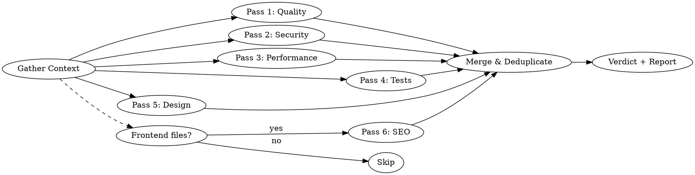

# Pass 6: SEO & AI Discoverability — Implementation Plan

> **For agentic workers:** REQUIRED: Use superpowers:subagent-driven-development (if subagents available) or superpowers:executing-plans to implement this plan. Steps use checkbox (`- [ ]`) syntax for tracking.

**Goal:** Add a conditional 6th review pass for SEO and AI discoverability to the deep-code-review skill.

**Architecture:** This is a documentation-only change — editing two markdown files (SKILL.md and README.md) to add Pass 6 alongside the existing five passes. No code, no tests. The "implementation" is writing precise natural-language instructions that Claude will follow at runtime.

**Tech Stack:** Markdown

**Spec:** `docs/superpowers/specs/2026-03-18-seo-ai-pass-design.md`

**Note:** Line numbers in each task reference the file state **before that task runs**. Since tasks modify the file sequentially, line numbers shift after each task. All step instructions use **exact content matching** (before/after text), so always match on content, not line numbers.

---

### Task 1: Update SKILL.md Section Heading, Overview, and Flow Diagram

**Files:**
- Modify: `skills/deep-code-review/SKILL.md:10` (overview paragraph)
- Modify: `skills/deep-code-review/SKILL.md:26-39` (section heading, intro sentence, flow diagram)

- [ ] **Step 1: Rename section heading**

Change line 26 from:
```
## The Five-Pass Review
```
to:
```
## The Review Passes
```

- [ ] **Step 2: Update intro sentence**

Change line 28 from:
```
Run all passes in parallel using subagents. Each pass produces findings in the standard format below.
```
to:
```
Run up to six passes in parallel using subagents. Passes 1–5 always run. Pass 6 (SEO & AI Discoverability) only runs when the diff contains frontend files — it is silently skipped otherwise. Each pass produces findings in the standard format below.
```

- [ ] **Step 3: Update overview paragraph**

Change line 10 from:
```
A comprehensive code review combining five expert perspectives — **code quality**, **security**, **performance**, **test quality**, and **design fit** — into a single structured review. Each perspective runs as a parallel analysis pass, producing severity-rated findings with actionable fixes.
```
to:
```
A comprehensive code review combining up to six expert perspectives — **code quality**, **security**, **performance**, **test quality**, **design fit**, and conditionally **SEO & AI discoverability** — into a single structured review. Each perspective runs as a parallel analysis pass, producing severity-rated findings with actionable fixes.
```

- [ ] **Step 4: Update flow diagram**

Replace the existing dot diagram (lines 30-39) with:


- [ ] **Step 5: Commit**

```bash
git add skills/deep-code-review/SKILL.md
git commit -m "feat: update heading, overview, and flow diagram for Pass 6"
```

---

### Task 2: Add Pass 6 Section to SKILL.md

**Files:**
- Modify: `skills/deep-code-review/SKILL.md` — insert after Pass 5 section (after line 146)

- [ ] **Step 1: Add the Pass 6 section**

Insert the following after the Pass 5 section (after the line `- **Alternative**: Brief sketch of a better approach`):

```markdown
### Pass 6: SEO & AI Discoverability (The Search Strategist) — Conditional

**This pass only runs when the diff contains frontend files** (`.html`, `.htm`, `.jsx`, `.tsx`, `.vue`, `.svelte`, `.astro`, `.njk`, `.ejs`, `.hbs`, `.php`, `.erb`, `.mdx`, `.md`) or SEO-specific files (`robots.txt`, `robots.ts`, `robots.js`, `sitemap.xml`, `sitemap.ts`, `sitemap.js`, `llms.txt`, `manifest.json`). If none are present, skip this pass silently.

Review as a search strategist optimizing for both traditional crawlers and AI systems (ChatGPT, Perplexity, Google AI Overviews).

**Scope:** Examine only the matching frontend files from the diff, reading surrounding layout/route files for context as needed. Prefer findings related to lines actually changed. Flag pre-existing issues only at CRITICAL or HIGH severity. Skip files clearly identifiable as email templates (e.g., in `email/` or `mailer/` directories). Files in route directories are never excluded.

**Page-level vs. leaf component classification:**

A component is **page-level** if any of: it lives in a route directory (`pages/`, `app/`, `routes/`, `src/routes/`, `src/pages/`); it is named `page.*`, `layout.*`, `_document.*`, `_app.*`, or `index.*` in a route directory; it renders `<html>`, `<head>`, or `<body>` tags; it exports `metadata`, `generateMetadata`, `meta`, or calls `useHead`/`useSeoMeta`. Everything else is **leaf-level** — only check `alt` on images, link text quality, and heading hierarchy within the component. When ambiguous, default to leaf-level.

**Priority checks** (always evaluate):

| Category | Look For |
|----------|----------|
| **Metadata** | Missing/duplicate `<title>`, `<meta description>`, canonical URLs, `<meta robots>`, viewport, charset, lang, OG tags (`og:title`, `og:description`, `og:image`), Twitter cards. Check the framework's idiomatic API before flagging raw `<head>` elements |
| **Structured data** | Missing/invalid schema.org (JSON-LD preferred), incorrect types (including typos), missing required properties, `datePublished`/`dateModified`, `Person` schema when applicable. When populated from CMS/external sources, flag template issues (e.g., missing null fallbacks) but not missing fields that may come from runtime data |
| **Semantic HTML & links** | Heading hierarchy skips, missing landmark roles (page-level only). Generic link text (`click here`, `read more`, empty `<a>`), `href="#"` / `javascript:void(0)` |
| **Crawlability** | JS-only content without SSR/SSG, client-side-only routing (hash-based `/#/page`), `<noscript>` fallbacks (only when SSR/SSG absent), conflicting signals (canonical vs. `noindex`), `robots.txt` rules blocking AI crawlers |

**Secondary checks** (evaluate if context permits):

| Category | Look For |
|----------|----------|
| **AI discoverability** | Missing `llms.txt`/`llms-full.txt`, missing RSS/Atom feeds (content-heavy/docs sites only) |
| **Accessibility & performance** | Missing `alt` attribute (do not flag `alt=""`), images/iframes without `width`/`height` (CLS), iframes missing `title`, hero images with `loading="lazy"` (anti-pattern — identify by component name containing "hero"/"banner"/"cover" or first image in a page-level component; use `fetchpriority="high"` instead), render-blocking external `<link>`/`<script>` without `async`/`defer` (do not flag inline `<style>`/`<script>`) |
| **Internationalization** | Missing `hreflang` (only when i18n evidence exists) |

**Security cross-references** — when a finding has security implications, add a `Cross-ref: Pass 2` field:

| Check | Security Risk |
|-------|--------------|
| Canonical URL pointing to external domain | Canonical hijacking |
| `og:image` from user input | SSRF, stored XSS via SVG |
| JSON-LD fields from unsanitized input | Script injection via `</script>` breakout (CWE-79) |
| Structured data exposing internal IDs/PII | Information disclosure |
| `robots.txt` `Disallow` revealing sensitive paths | Path enumeration |
| `llms.txt` referencing internal endpoints | Architecture disclosure |

These checks assess what is visible in the frontend template code. When data flow from backend sources cannot be determined from the diff, use "Needs investigation" confidence.

**Key rules:**
1. Check the layout/route chain before flagging missing meta tags. Metadata may be inherited from parent layouts (Next.js App Router `generateMetadata`, Remix v2+ `meta`, Nuxt `useHead` in layouts).
2. Use "Needs investigation" confidence when a check cannot be fully verified from the diff: SSR/SSG status without framework signals, structured data vs. Google's requirements, broken links/orphan pages, `llms.txt` relevance, image dimensions in Tailwind/CSS-in-JS, ambiguous locale paths, content extractability. For hero/LCP images: use higher confidence when the heuristic matches; "Needs investigation" otherwise.
3. Err on fewer, higher-confidence findings. Zero findings is acceptable for well-maintained codebases.

**Severity calibration for SEO findings:**

| Severity | SEO Example |
|----------|-------------|
| **CRITICAL** | `noindex` on a page meant to be indexed; JSON-LD script injection |
| **HIGH** | Missing `<title>` (after checking inheritance); all images missing `alt`; JS-only content with no SSR; hash-based routing; AI crawlers blocked in `robots.txt` unintentionally |
| **MEDIUM** | Missing OG tags; heading hierarchy skips; missing canonical; CLS from missing dimensions; generic link text |
| **LOW** | Missing `llms.txt`; minor structured data gaps; missing iframe `title`; `href="#"` with onClick handler |

For each finding, include:
- **SEO impact**: How this affects search ranking or AI discoverability (1-2 sentences)
- **Affected signal**: Human-readable context — e.g., "Core Web Vitals: CLS", "Google Search: structured data"
- **Cross-ref** (optional): Which other pass this finding overlaps with

**Out of scope:** Framework config files, micro-frontend fragments (shell owns `<head>`), CSS-only concerns (except inline `@font-face`), runtime behavior, HTTP headers, CDN/caching, redirect rules, mobile UX beyond viewport.
```

- [ ] **Step 2: Commit**

```bash
git add skills/deep-code-review/SKILL.md
git commit -m "feat: add Pass 6 — SEO & AI Discoverability section"
```

---

### Task 3: Update Finding Format, Execution, Dedup, and Common Mistakes in SKILL.md

**Files:**
- Modify: `skills/deep-code-review/SKILL.md:156` (Pass tag line in finding format)
- Modify: `skills/deep-code-review/SKILL.md:223` (dedup instruction)
- Modify: `skills/deep-code-review/SKILL.md:229-234` (execution section)
- Modify: `skills/deep-code-review/SKILL.md:237-248` (common mistakes table)

- [ ] **Step 1: Update Finding Format pass tag line**

Change line 156 from:
```
**Pass:** Quality | Security | Performance | Tests | Design
```
to:
```
**Pass:** Quality | Security | Performance | Tests | Design | SEO & AI Discoverability
```

- [ ] **Step 2: Add Cross-ref field to finding format**

After the line `**Confidence:** Certain | High | Needs investigation` (line 157), add:
```
**Cross-ref:** [Optional — other pass this overlaps with, e.g., "Pass 2: XSS"]
```

- [ ] **Step 3: Update dedup instruction**

After the existing dedup text on line 223 (`Deduplicate: if the same code triggers findings in multiple passes...merge into one finding and tag all applicable passes.`), append:
```
 When merged findings have different severities across passes, use the higher severity.
```

- [ ] **Step 4: Update execution section**

Change line 230 from:
```
2. **Launch five parallel subagents** — one per pass, each with the relevant checklist above and the code to review.
```
to:
```
2. **Launch up to six parallel subagents** — one per pass, each with the relevant checklist above and the code to review. Pass 6 (SEO & AI Discoverability) is only launched when frontend files are in the diff; otherwise it is skipped silently. For large diffs with > 10 frontend files, focus Pass 6 on page-level files first.
```

Change line 234 from:
```
If the codebase is small (< 200 lines changed), run all passes yourself without subagents.
```
to:
```
If the codebase is small (< 200 lines changed), run all passes yourself without subagents. Apply the same conditional for Pass 6: skip SEO checks if no frontend files are in the diff.
```

- [ ] **Step 5: Add new rows to Common Mistakes table**

Append these rows to the existing Common Mistakes table (after line 247):

```markdown
| Flagging missing meta tags in leaf components | Only flag at page/layout-level. Check framework inheritance first. |
| Flagging `alt=""` as missing alt text | Empty alt is correct for decorative images. Only flag missing `alt` attribute. |
| Flagging email templates for SEO issues | Exclude email template directories (unless also a route directory). |
| Lazy-loading the LCP/hero image | `loading="lazy"` on above-fold images delays LCP. Use `fetchpriority="high"` instead. |
| Laundry-listing pre-existing SEO issues | Focus on changes in the diff. Only flag pre-existing issues at CRITICAL/HIGH. |
```

- [ ] **Step 6: Commit**

```bash
git add skills/deep-code-review/SKILL.md
git commit -m "feat: update finding format, execution, dedup, and common mistakes for Pass 6"
```

---

### Task 4: Update README.md

**Files:**
- Modify: `README.md:9` (opening paragraph)
- Modify: `README.md:11-17` (passes table)
- Modify: `README.md:68` (stale "three-pass" reference)
- Modify: `README.md:106` (stale "strip the other two" reference)

- [ ] **Step 1: Update opening paragraph**

Change line 9 from:
```
A five-pass code review that runs **quality**, **security**, **performance**, **test quality**, and **design fit** analysis in parallel, then merges findings into a single severity-ranked report with an instant verdict.
```
to:
```
A code review that runs up to six analysis passes — **quality**, **security**, **performance**, **test quality**, **design fit**, and conditionally **SEO & AI discoverability** — in parallel, then merges findings into a single severity-ranked report with an instant verdict.
```

- [ ] **Step 2: Add Pass 6 row to passes table**

After the Design row (line 17), add:
```markdown
| **SEO & AI** *(conditional)* | Search strategist for crawlers and AI | Missing meta/OG tags, structured data issues, crawlability problems, AI discoverability gaps, heading hierarchy, link quality (only when frontend files are in the diff) |
```

- [ ] **Step 3: Fix stale "three-pass" reference**

Change line 68 from:
```
Claude will identify the current diff/staged changes and run the full three-pass review.
```
to:
```
Claude will identify the current diff/staged changes and run the full review.
```

- [ ] **Step 4: Fix stale "strip the other two" reference**

Change line 106 from:
```
- **Remove a pass** — if you only care about security, strip the other two
```
to:
```
- **Remove a pass** — if you only care about security, strip the other passes
```

- [ ] **Step 5: Commit**

```bash
git add README.md
git commit -m "docs: update README for Pass 6 and fix stale references"
```

---

### Task 5: Final Verification

- [ ] **Step 1: Read SKILL.md end-to-end and verify consistency**

Read the full `skills/deep-code-review/SKILL.md` file. Check:
- Section heading says "The Review Passes" (not "Five-Pass")
- Overview says "up to six expert perspectives"
- Flow diagram has 6 passes with conditional gate on Pass 6
- Pass 6 section exists after Pass 5
- Finding format includes `SEO & AI Discoverability` pass tag and `Cross-ref` field
- Execution says "up to six parallel subagents" with conditional note
- Dedup has severity tiebreaker rule
- Common Mistakes has 5 new SEO rows

- [ ] **Step 2: Read README.md and verify consistency**

Read the full `README.md`. Check:
- Opening paragraph says "up to six analysis passes"
- Passes table has 6 rows
- No "three-pass" or "five-pass" references remain
- No "strip the other two" reference remains

- [ ] **Step 3: Commit if any fixes were needed**

```bash
git add skills/deep-code-review/SKILL.md README.md
git commit -m "fix: consistency fixes from final verification"
```
