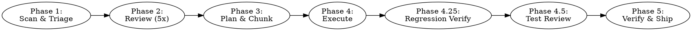

# Skill System v2 Implementation Plan

> **For agentic workers:** REQUIRED SUB-SKILL: Use superpowers:subagent-driven-development (recommended) or superpowers:executing-plans to implement this plan task-by-task. Steps use checkbox (`- [ ]`) syntax for tracking.

**Goal:** Restructure the claude-skills repo with a build system, upgrade both existing skills (scoring, posture, handoffs, retry, regression, dev-QA), and add 4 new skills (improve, project-context, red-team-review, review-regression).

**Architecture:** Source skills live in `source/skills/`, a build script validates and copies them to `dist/claude-code/skills/` with a manifest. Skills are markdown files — no runtime code. The `improve` skill acts as a smart router that auto-detects scope and chains other skills.

**Tech Stack:** Bun/Node.js for the build script. All skills are pure markdown (SKILL.md).

---

## File Map

| Action | Path | Purpose |
|--------|------|---------|
| Move | `skills/deep-code-review/SKILL.md` → `source/skills/deep-code-review/SKILL.md` | Relocate to source dir |
| Move | `skills/code-improvement-orchestrator/SKILL.md` → `source/skills/code-improvement-orchestrator/SKILL.md` | Relocate to source dir |
| Create | `source/skills/deep-code-review/anti-patterns.md` | Living anti-pattern checklist |
| Create | `source/skills/code-improvement-orchestrator/handoff-templates.md` | Structured handoff definitions |
| Create | `source/skills/improve/SKILL.md` | Smart router entry point |
| Create | `source/skills/project-context/SKILL.md` | Project onboarding |
| Create | `source/skills/red-team-review/SKILL.md` | Adversarial security review |
| Create | `source/skills/review-regression/SKILL.md` | Fix verification |
| Create | `scripts/build.js` | Build pipeline |
| Create | `providers.js` | Provider configs |
| Create | `package.json` | Scripts and metadata |
| Create | `.gitignore` | Ignore dist/ |
| Update | `README.md` | New structure, all 6 skills, build instructions |

---

### Task 1: Repository Restructure

**Files:**
- Create: `source/skills/` directory structure
- Move: `skills/deep-code-review/SKILL.md` → `source/skills/deep-code-review/SKILL.md`
- Move: `skills/code-improvement-orchestrator/SKILL.md` → `source/skills/code-improvement-orchestrator/SKILL.md`
- Create: `.gitignore`

- [ ] **Step 1: Create source directory structure**

```bash
mkdir -p source/skills/deep-code-review
mkdir -p source/skills/code-improvement-orchestrator
mkdir -p source/skills/improve
mkdir -p source/skills/project-context
mkdir -p source/skills/red-team-review
mkdir -p source/skills/review-regression
mkdir -p scripts
```

- [ ] **Step 2: Move existing skills to source**

```bash
cp skills/deep-code-review/SKILL.md source/skills/deep-code-review/SKILL.md
cp skills/code-improvement-orchestrator/SKILL.md source/skills/code-improvement-orchestrator/SKILL.md
```

- [ ] **Step 3: Create .gitignore**

Write `.gitignore`:

```
dist/
node_modules/
```

- [ ] **Step 4: Verify files are in place**

```bash
ls -la source/skills/deep-code-review/SKILL.md
ls -la source/skills/code-improvement-orchestrator/SKILL.md
cat .gitignore
```

Expected: both SKILL.md files exist, .gitignore contains `dist/` and `node_modules/`.

- [ ] **Step 5: Commit**

```bash
git add source/ .gitignore
git commit -m "chore: restructure repo — move skills to source/"
```

---

### Task 2: Build System

**Files:**
- Create: `package.json`
- Create: `providers.js`
- Create: `scripts/build.js`

- [ ] **Step 1: Create package.json**

Write `package.json`:

```json
{
  "name": "claude-skills",
  "version": "2.0.0",
  "description": "Custom skills for Claude Code",
  "type": "module",
  "scripts": {
    "build": "node scripts/build.js",
    "validate": "node scripts/build.js --validate-only"
  },
  "license": "MIT"
}
```

- [ ] **Step 2: Create providers.js**

Write `providers.js`:

```js
export default [
  {
    name: "claude-code",
    outputDir: "dist/claude-code/skills",
    skillFile: "SKILL.md",
    transform: (content, _metadata) => content,
    companionFiles: true,
  },
];
```

- [ ] **Step 3: Create scripts/build.js**

Write `scripts/build.js`:

```js
import { readdir, readFile, writeFile, mkdir, cp } from "node:fs/promises";
import { join, resolve } from "node:path";
import { existsSync } from "node:fs";
import providers from "../providers.js";

const ROOT = resolve(import.meta.dirname, "..");
const SOURCE = join(ROOT, "source", "skills");
const validateOnly = process.argv.includes("--validate-only");
const providerFilter = process.argv
  .find((a) => a.startsWith("--provider="))
  ?.split("=")[1];

function parseFrontmatter(content) {
  const match = content.match(/^---\n([\s\S]*?)\n---/);
  if (!match) return null;
  const meta = {};
  for (const line of match[1].split("\n")) {
    const idx = line.indexOf(":");
    if (idx === -1) continue;
    meta[line.slice(0, idx).trim()] = line.slice(idx + 1).trim();
  }
  return meta;
}

async function discoverSkills() {
  const entries = await readdir(SOURCE, { withFileTypes: true });
  const skills = [];

  for (const entry of entries) {
    if (!entry.isDirectory()) continue;
    const skillDir = join(SOURCE, entry.name);
    const skillFile = join(skillDir, "SKILL.md");

    if (!existsSync(skillFile)) {
      console.error(`FAIL: ${entry.name}/ has no SKILL.md`);
      process.exit(1);
    }

    const content = await readFile(skillFile, "utf-8");
    const meta = parseFrontmatter(content);

    if (!meta) {
      console.error(`FAIL: ${entry.name}/SKILL.md has no frontmatter`);
      process.exit(1);
    }
    if (!meta.name) {
      console.error(`FAIL: ${entry.name}/SKILL.md missing 'name' in frontmatter`);
      process.exit(1);
    }
    if (!meta.description) {
      console.error(`FAIL: ${entry.name}/SKILL.md missing 'description' in frontmatter`);
      process.exit(1);
    }

    // Find companion files (non-SKILL.md markdown files)
    const allFiles = await readdir(skillDir);
    const companions = allFiles.filter(
      (f) => f.endsWith(".md") && f !== "SKILL.md"
    );

    // Validate companion references in SKILL.md
    for (const companion of companions) {
      // Companion exists, that's fine. Check if SKILL.md references it.
      // (Non-referenced companions are a warning, not an error)
    }

    skills.push({
      name: entry.name,
      dir: skillDir,
      meta,
      content,
      companions,
    });
  }

  return skills;
}

async function buildProvider(provider, skills) {
  const outDir = join(ROOT, provider.outputDir);

  for (const skill of skills) {
    const skillOutDir = join(outDir, skill.name);
    await mkdir(skillOutDir, { recursive: true });

    const transformed = provider.transform(skill.content, skill.meta);
    await writeFile(join(skillOutDir, provider.skillFile), transformed);

    if (provider.companionFiles) {
      for (const companion of skill.companions) {
        await cp(join(skill.dir, companion), join(skillOutDir, companion));
      }
    }
  }

  // Generate manifest
  const manifest = {
    version: "2.0.0",
    provider: provider.name,
    built: new Date().toISOString(),
    skills: skills.map((s) => ({
      name: s.meta.name,
      description: s.meta.description,
      files: [provider.skillFile, ...s.companions],
    })),
  };

  await writeFile(
    join(outDir, "..", "manifest.json"),
    JSON.stringify(manifest, null, 2)
  );
}

async function main() {
  console.log("Discovering skills...");
  const skills = await discoverSkills();
  console.log(`Found ${skills.length} skills: ${skills.map((s) => s.name).join(", ")}`);

  if (validateOnly) {
    console.log("Validation passed.");
    return;
  }

  const targets = providerFilter
    ? providers.filter((p) => p.name === providerFilter)
    : providers;

  if (targets.length === 0) {
    console.error(`No provider found matching '${providerFilter}'`);
    process.exit(1);
  }

  for (const provider of targets) {
    console.log(`Building for ${provider.name}...`);
    await buildProvider(provider, skills);
    console.log(`  → ${provider.outputDir}/`);
  }

  console.log("Build complete.");
}

main();
```

- [ ] **Step 4: Run build to verify it works**

```bash
node scripts/build.js
```

Expected:
```
Discovering skills...
Found 2 skills: code-improvement-orchestrator, deep-code-review
Building for claude-code...
  → dist/claude-code/skills/
Build complete.
```

- [ ] **Step 5: Verify output**

```bash
ls dist/claude-code/skills/
cat dist/claude-code/manifest.json
diff source/skills/deep-code-review/SKILL.md dist/claude-code/skills/deep-code-review/SKILL.md
```

Expected: two skill directories, valid manifest JSON, diff shows no differences.

- [ ] **Step 6: Run validate-only mode**

```bash
node scripts/build.js --validate-only
```

Expected: `Validation passed.`

- [ ] **Step 7: Commit**

```bash
git add package.json providers.js scripts/build.js
git commit -m "feat: add build system — validates and packages skills from source/ to dist/"
```

---

### Task 3: Anti-Patterns Companion File

**Files:**
- Create: `source/skills/deep-code-review/anti-patterns.md`

- [ ] **Step 1: Create anti-patterns.md**

Write `source/skills/deep-code-review/anti-patterns.md`:

```markdown
# Anti-Patterns Checklist

Check code against these patterns during Pass 1 (Quality). These are commonly produced by AI-generated code and frequently missed in review. This is a living document — add new patterns as they are identified.

## Error Handling
- Swallowed exceptions with generic fallbacks (catch → console.log → return default value)
- Try/catch wrapping entire functions instead of specific risky operations
- Returning null/undefined instead of throwing when callers need to know about failure
- Empty catch blocks or catch blocks that only re-throw without additional context
- Catching broad exception types (Exception, Error) when specific types are available

## Over-Engineering
- Factory/strategy/builder patterns for single-use cases
- Abstract base classes with only one implementation
- Dependency injection containers in scripts with 3 dependencies
- Configuration objects for values that never change
- Generic type parameters that are always the same concrete type
- Wrapper classes that add no behavior (pass-through delegation)

## Dead Code & Cargo Cult
- Backward-compatibility shims for code that was just written
- Feature flags for features that are always on
- Commented-out code blocks "for reference"
- Unused imports, variables, functions left behind after refactoring
- Re-exporting removed types/functions as undefined
- Copied boilerplate (logging setup, error handlers) that doesn't match the project's existing patterns

## False Safety
- Null checks on values that can't be null (TypeScript strict mode, required fields, just-constructed objects)
- Validation at internal boundaries (function A validates, passes to function B, B re-validates the same thing)
- Defensive copies of immutable data
- Type assertions immediately after type guards that already narrowed the type
- Optional chaining on values that are guaranteed to exist by the surrounding logic

## Documentation
- Over-commenting obvious code (`// increment counter` above `counter++`)
- Under-commenting tricky code (complex regex, bit manipulation, non-obvious algorithms)
- JSDoc that restates the function name (`@description Gets the user` on `getUser()`)
- TODO comments with no context, owner, or tracking reference
- Comments describing what code does instead of why (the code already says what)

## Structure
- God functions (>50 lines doing multiple unrelated things)
- Premature abstraction (helper/utility created for a single call site)
- Deep nesting (>3 levels of if/for/try — flatten with early returns or extraction)
- Inconsistent patterns across the codebase (some files use pattern X, others use Y for the same thing)
- Mixing concerns in a single function (I/O + business logic + formatting)
```

- [ ] **Step 2: Verify file is valid markdown**

```bash
head -5 source/skills/deep-code-review/anti-patterns.md
```

Expected: shows the `# Anti-Patterns Checklist` header.

- [ ] **Step 3: Commit**

```bash
git add source/skills/deep-code-review/anti-patterns.md
git commit -m "feat: add anti-patterns checklist companion file for deep-code-review"
```

---

### Task 4: Handoff Templates Companion File

**Files:**
- Create: `source/skills/code-improvement-orchestrator/handoff-templates.md`

- [ ] **Step 1: Create handoff-templates.md**

Write `source/skills/code-improvement-orchestrator/handoff-templates.md`:

````markdown
# Handoff Templates

All agent communication with the orchestrator MUST use one of these templates. Free-form reports are not accepted. The orchestrator parses these structured handoffs to update TODO.md, make routing decisions, and track metrics.

## STANDARD — Normal Task Completion

Use when a stream completes successfully.

```
TYPE: STANDARD
STREAM: <stream name>
STATUS: COMPLETE
FILES_CHANGED: <comma-separated list of file paths>
BRANCH: <worktree branch name>
FINDINGS_RESOLVED: <count of findings fixed>
TESTS_ADDED: <count of new test cases>
TESTS_PASSING: <YES or NO>
SUMMARY: <1-2 sentence description of what was done>
```

## QA_PASS — Review Passes Quality Gate

Use when a review scores >= 95/100 overall.

```
TYPE: QA_PASS
STREAM: <stream name>
OVERALL_SCORE: <0-100 weighted score>
DIMENSIONS: Quality:<n> Security:<n> Performance:<n> Tests:<n> Design:<n>
FINDINGS_COUNT: <total findings across all dimensions>
CRITICAL: <count> HIGH: <count> MEDIUM: <count> LOW: <count>
EVIDENCE: <top 3 findings with ID, file:line, and one-line description>
VERDICT: APPROVE | APPROVE_WITH_NOTES
```

## QA_FAIL — Review Fails Quality Gate

Use when a review scores < 95/100 overall.

```
TYPE: QA_FAIL
STREAM: <stream name>
OVERALL_SCORE: <0-100 weighted score>
DIMENSIONS: Quality:<n> Security:<n> Performance:<n> Tests:<n> Design:<n>
FAILING_DIMENSIONS: <list of dimensions scoring below 95>
TOP_FINDINGS: <top 5 findings to fix, each with ID, severity, file:line, title>
SUGGESTED_APPROACH: <1-3 sentences on how to address the top findings>
VERDICT: NEEDS_CHANGES | BLOCK
```

## ESCALATION — Agent Is Stuck or Blocked

Use when an agent cannot complete its task. Triggers the retry policy.

```
TYPE: ESCALATION
STREAM: <stream name>
ATTEMPT: <1, 2, or 3>
WHAT_WAS_TRIED: <specific actions taken, with file paths and commands>
WHY_IT_FAILED: <specific error message, test failure, or blocker>
ROOT_CAUSE: <hypothesis for why this approach failed>
RECOMMENDED_RESOLUTION: <retry_different_approach | decompose | human_input_needed | skip_with_reason>
FAILURE_HISTORY: <summary of all previous attempts, if attempt > 1>
```

## Parsing Rules

The orchestrator processes handoffs as follows:

1. Read the `TYPE` field first to determine the template.
2. All fields are required — reject handoffs with missing fields.
3. `TESTS_PASSING: NO` in a STANDARD handoff triggers immediate investigation (do not merge).
4. `VERDICT: BLOCK` in a QA_FAIL means the stream has a CRITICAL finding that prevents merge.
5. `ATTEMPT: 3` in an ESCALATION means the retry policy is exhausted — mark the stream `[!]`.
````

- [ ] **Step 2: Verify file**

```bash
head -5 source/skills/code-improvement-orchestrator/handoff-templates.md
```

Expected: shows `# Handoff Templates` header.

- [ ] **Step 3: Commit**

```bash
git add source/skills/code-improvement-orchestrator/handoff-templates.md
git commit -m "feat: add structured handoff templates for orchestrator agent communication"
```

---

### Task 5: Update deep-code-review SKILL.md

**Files:**
- Modify: `source/skills/deep-code-review/SKILL.md`

This task adds three sections to the existing SKILL.md: the scoring model, review posture, and ReACT review method. These are inserted after the Overview section and before the existing passes. The anti-patterns reference is added to Pass 1.

- [ ] **Step 1: Read current SKILL.md header to find insertion point**

```bash
head -30 source/skills/deep-code-review/SKILL.md
```

Locate the line after the `## When to Use` / `## When NOT to use` section and before `## The Review Passes`.

- [ ] **Step 2: Insert Review Posture section after "When NOT to use"**

Find the line `## The Review Passes` and insert immediately before it:

```markdown
## Review Posture

You are a skeptical reviewer. Your default stance is "this code has issues I haven't found yet."

- Zero findings on 100+ lines of code is a red flag. Re-examine before reporting clean.
- A score of 75-85 on first review is normal and expected. 95+ on first pass is suspicious — verify you didn't miss issues.
- If you found fewer than 3 findings on 200+ lines of changed code, you likely missed something. Look harder.
- Every finding must include evidence (code snippet, grep result, test output). No hunches.
- "Looks fine" is not a finding. "No issues found" requires justification: what you checked and why it's clean.

## Scoring Model

### Per-Finding Severity (CVSS-Inspired)

Each finding is scored on 4 factors producing a 0-10 severity:

| Factor | Range | Description |
|--------|-------|-------------|
| **Impact** | 0-4 | Damage if exploited/triggered. 4 = data breach/RCE, 3 = data corruption/service down, 2 = degraded functionality, 1 = cosmetic/minor, 0 = negligible |
| **Exploitability** | 0-4 | How easy to trigger. 4 = unauthenticated remote, 3 = authenticated remote, 2 = requires specific conditions, 1 = requires local access, 0 = theoretical only |
| **Human Factor** | 0-1.5 | Additional risk from social/insider vectors. 1.5 = no special knowledge needed, 1.0 = requires insider context, 0.5 = requires social engineering, 0 = N/A |
| **Complexity Penalty** | 0-0.5 | Bonus deduction for trivially simple exploits. 0.5 = copy-paste exploit, 0.25 = simple script, 0 = requires chaining |

**Severity = Impact + Exploitability + Human Factor + Complexity Penalty** (capped at 10.0)

Severity labels derived from score:
- **CRITICAL**: 9.0-10.0
- **HIGH**: 7.0-8.9
- **MEDIUM**: 4.0-6.9
- **LOW**: 0.1-3.9

### Named Dimension Scores

Each review pass produces a dimension score (0-100). The report surfaces all dimensions:

```
Quality: 88 | Security: 72 | Performance: 95 | Tests: 64 | Design: 91
```

Dimension score calculation: starts at 100, deducts per finding based on finding severity:
- Severity 9.0-10.0: -12
- Severity 7.0-8.9: -7
- Severity 4.0-6.9: -3
- Severity 0.1-3.9: -1

Conditional passes (SEO, SOC 2, GDPR, Docs, a11y, i18n, Marketing) produce their own dimension scores when triggered.

### Weighted Overall Score

Overall score = weighted average of dimension scores.

| Dimension | Default Weight | Rationale |
|-----------|---------------|-----------|
| Security | 5 | Exploitable in prod, highest business risk |
| Quality | 3 | Bugs ship to users |
| Tests | 3 | Safety net for future changes |
| Performance | 2 | Matters at scale |
| Design | 2 | Long-term maintainability |
| Each conditional pass | 1 | Context-dependent, lower base weight |

Formula: `overall = sum(dimension_score * weight) / sum(weights)`

Pass threshold: **95/100 overall**.

### Structured Finding Format

Every finding MUST use this structure:

```
ID: <PASS>-<NNN>          (e.g., SEC-003, QUAL-012)
Pass: <pass name>
Severity: <0-10 score> (<CRITICAL|HIGH|MEDIUM|LOW>)
Title: <one-line description>
File: <path>:<line>
Evidence: <what the reviewer found, with code snippets>
Impact: <what goes wrong if unfixed>
Fix: <suggested code change or approach>
Regression-ID: <same as ID, used by review-regression to verify fix>
```

## Review Method: ReACT (Reason → Act → Conclude)

For each review pass, follow this three-step process. Do NOT skip Step 2.

### Step 1: PLAN (Reason)
Scan the diff. Identify areas of concern. List what you will investigate:
- "Lines 42-68: complex auth logic, will check for bypass scenarios"
- "New dependency added at line 3, will check for known CVEs"
- "No tests visible for the new endpoint, will check test files"

### Step 2: INVESTIGATE (Act)
For each planned investigation, use tools to gather evidence:
- Grep for related code patterns across the codebase
- Read test files for the changed modules
- Check callers/consumers of changed functions
- Search for similar patterns that might need the same fix
- Verify claims in comments against actual behavior

### Step 3: SYNTHESIZE (Conclude)
Produce findings backed by evidence from Step 2. Every finding must reference what you found during investigation, not just what you see in the diff.

A review without investigation is a guess.

## Project Context

If `.project-context.md` exists in the project root, read it before starting any review pass. Use it to:
- Trigger compliance passes (SOC 2, GDPR) based on declared compliance requirements, even if the diff alone wouldn't trigger them
- Calibrate framework-specific checks (e.g., Next.js App Router patterns vs Pages Router)
- Understand the architecture (monorepo packages, service boundaries) to scope findings correctly
- Identify known areas of concern that deserve extra scrutiny

```

- [ ] **Step 3: Add anti-patterns reference to Pass 1**

In Pass 1 (Code Quality), find the table row for `| **Dead code & unused dependencies** |` and after the existing table, add:

```markdown
**Anti-patterns check:** Also review against the anti-patterns checklist in `anti-patterns.md`. Flag any matches as findings.
```

- [ ] **Step 4: Replace old scoring references**

Find and replace the old scoring instructions. Search for any references to "CRITICAL -15, HIGH -8, MEDIUM -3, LOW -1" or "Quality score" or "Score starts at 100" in the SKILL.md and update them to reference the new scoring model section. The old `## Scoring` section (if it exists at the end of the file) should be removed since the new one is at the top.

- [ ] **Step 5: Verify the updated file has valid structure**

```bash
head -10 source/skills/deep-code-review/SKILL.md
grep "## Review Posture" source/skills/deep-code-review/SKILL.md
grep "## Scoring Model" source/skills/deep-code-review/SKILL.md
grep "## Review Method" source/skills/deep-code-review/SKILL.md
grep "anti-patterns.md" source/skills/deep-code-review/SKILL.md
```

Expected: all four sections found, anti-patterns reference present.

- [ ] **Step 6: Run build to verify skill still validates**

```bash
node scripts/build.js --validate-only
```

Expected: `Validation passed.`

- [ ] **Step 7: Commit**

```bash
git add source/skills/deep-code-review/SKILL.md
git commit -m "feat: add CVSS scoring, skeptical posture, ReACT review method to deep-code-review"
```

---

### Task 6: Update code-improvement-orchestrator SKILL.md

**Files:**
- Modify: `source/skills/code-improvement-orchestrator/SKILL.md`

This task adds four features to the existing orchestrator: handoff template references, formal retry policy, regression verification phase (4.25), and dev-QA continuous loop.

- [ ] **Step 1: Read current orchestrator SKILL.md structure**

```bash
grep "^## \|^### " source/skills/code-improvement-orchestrator/SKILL.md
```

Identify where to insert each new section.

- [ ] **Step 2: Add handoff template reference**

Find the `**Core rules:**` section. After the bullet about `TODO always updated`, add:

```markdown
- **Structured handoffs only.** All agent communication with the orchestrator must use the templates defined in `handoff-templates.md`. Four types: STANDARD (task complete), QA_PASS (review passes), QA_FAIL (review fails), ESCALATION (agent stuck). Free-form reports are not accepted.
```

- [ ] **Step 3: Replace retry policy**

Find the `## Failure & Retry` section. Replace the existing content:

```markdown
## Failure & Retry

Maximum 3 attempts per stream. Each attempt carries full failure context.

**Attempt 1:** Agent works the stream normally. On failure, agent submits an ESCALATION handoff (see `handoff-templates.md`) with root cause hypothesis.

**Attempt 2:** Fresh agent receives the original task plus the ESCALATION from attempt 1. Agent MUST use a different approach than attempt 1 (the escalation documents what was tried). On failure, agent submits ESCALATION with both attempt histories.

**Attempt 3:** Fresh agent receives the original task plus ESCALATIONs from attempts 1 and 2. Agent MUST try a third distinct approach. On failure, mark stream `[!] Failed (3 attempts exhausted)`. Log full failure history in `decisions.md` including all 3 approaches tried, all 3 root causes, and recommendation for human.

**What counts as a "different approach":**
- Different algorithm or library
- Different file structure or abstraction
- Fixing a different root cause (if attempt 1 misdiagnosed)
- Decomposing into smaller sub-streams

"Retry the same thing" is NOT a different approach.

**Merge conflict:** If rebase has conflicts, dispatch a subagent to resolve. If unresolvable (>3 conflict files), mark `[!] Conflict`, preserve worktree, defer to human.
```

- [ ] **Step 4: Add Phase 4.25 (Regression Verification)**

Find `### Phase 4.5: Test Adequacy Review`. Insert immediately before it:

```markdown
### Phase 4.25: Regression Verification

Verify that Phase 4 fixes actually resolved the original Phase 2 findings.

1. Collect all finding IDs (e.g., SEC-003, QUAL-012) from Phase 2 that were assigned to fix streams in Phase 3.
2. Dispatch `review-regression` skill on the fix branch with the findings list.
3. For each finding, the skill checks:
   - Is the problematic code pattern still present? (grep/read the file:line)
   - Does the fix address the root cause or just the symptom?
   - Did the fix introduce any new issues in the same area?
4. Output per finding: `CONFIRMED_FIXED` | `STILL_PRESENT` | `REGRESSED` | `INCONCLUSIVE`
5. Any `STILL_PRESENT` findings: group into new fix streams and re-dispatch (Phase 4 loop).
6. Any `REGRESSED` findings: treat as new CRITICAL findings, dispatch fix streams.
7. `INCONCLUSIVE`: log in `decisions.md`, proceed.

Phase 4.25 does NOT replace Phase 4.5 (Test Review). It complements it:
- Phase 4.25 verifies specific findings are resolved (targeted, fast).
- Phase 4.5 verifies test adequacy of new code (broad, thorough).

**Short-circuit:** If Phase 4 produced no code changes, skip directly to Phase 4.5.

**Verify TODO before status table** — read TODO.md. All regression results must be recorded.

**Print status table after this phase.**

```
## Phase 4.25 Completion
- [ ] All Phase 2 finding IDs collected
- [ ] review-regression dispatched on fix branch
- [ ] STILL_PRESENT findings re-dispatched (or none found)
- [ ] REGRESSED findings treated as new CRITICALs (or none found)
- [ ] TODO.md updated (GATE)
- [ ] Status table printed
```
```

- [ ] **Step 5: Add dev-QA continuous loop to Phase 4**

Find `### Phase 4: Execute`. In the numbered list, after the existing step about merge to fix branch, add:

```markdown
8. **Per-stream mini-review** — when a stream completes and before merging, dispatch 1 agent to review ONLY that stream's changes (the diff of the worktree branch, not the full fix branch). Agent uses `deep-code-review` with all passes relevant to the stream. If score >= 95: proceed to merge. If score < 95: agent submits QA_FAIL handoff, orchestrator re-dispatches fix agent with QA_FAIL findings. Repeat until 95+ or 3 attempts exhausted (use retry policy). Only merge clean streams to fix branch.
```

- [ ] **Step 6: Update Phase 4 workflow diagram**

Update the `digraph orchestrator` flowchart to include Phase 4.25:



- [ ] **Step 7: Add project context reference**

In Phase 1 (Scan & Triage), step 1 (Detect project structure), add:

```markdown
If `.project-context.md` exists in the project root, read it first and use its contents to skip auto-detection of stack, architecture, and compliance requirements. Only auto-detect what the context file doesn't cover.
```

- [ ] **Step 8: Verify structure**

```bash
grep "handoff-templates.md" source/skills/code-improvement-orchestrator/SKILL.md
grep "Phase 4.25" source/skills/code-improvement-orchestrator/SKILL.md
grep "mini-review" source/skills/code-improvement-orchestrator/SKILL.md
grep "3 attempts" source/skills/code-improvement-orchestrator/SKILL.md
```

Expected: all four references found.

- [ ] **Step 9: Run build validation**

```bash
node scripts/build.js --validate-only
```

Expected: `Validation passed.`

- [ ] **Step 10: Commit**

```bash
git add source/skills/code-improvement-orchestrator/SKILL.md
git commit -m "feat: add structured handoffs, 3-attempt retry, Phase 4.25 regression, dev-QA loop to orchestrator"
```

---

### Task 7: Create project-context Skill

**Files:**
- Create: `source/skills/project-context/SKILL.md`

- [ ] **Step 1: Write SKILL.md**

Write `source/skills/project-context/SKILL.md`:

````markdown
---
name: project-context
description: Gathers project context through auto-detection and optional interview. Outputs .project-context.md for use by all other skills. Run once per project, update as needed.
---

# Project Context

## Overview

Gathers project context through auto-detection and optional user interview, then writes a `.project-context.md` file at the project root. All other skills (`deep-code-review`, `code-improvement-orchestrator`, `red-team-review`, `improve`) read this file to calibrate their behavior — triggering compliance passes, focusing attack scenarios, skipping redundant detection, and adjusting framework-specific checks.

Run once per project. Re-run to update when the stack changes.

## When to Use

- First time running any skill on a new project
- After major stack changes (new framework, new deployment target, new compliance requirement)
- When `/improve` detects `.project-context.md` is missing (auto-triggered)

## Process

### Step 1: Auto-Detection

Scan the project to populate context automatically. No user interaction needed for this step.

| Category | How to Detect |
|----------|--------------|
| **Languages** | File extensions (`.ts`, `.py`, `.go`, `.rs`, `.java`, `.rb`, `.php`), shebangs in scripts |
| **Frameworks** | `package.json` dependencies, `requirements.txt`/`pyproject.toml`, `go.mod`, `Gemfile`, `Cargo.toml`, `build.gradle`/`pom.xml` |
| **Architecture** | Workspace configs (`pnpm-workspace.yaml`, `package.json` workspaces, `settings.gradle`), `docker-compose.yml` services, directory structure patterns |
| **Testing** | Test directories (`__tests__/`, `tests/`, `test/`, `spec/`), test framework deps (jest, pytest, go test, rspec), test scripts in `package.json` |
| **CI/CD** | `.github/workflows/`, `Jenkinsfile`, `.gitlab-ci.yml`, `.circleci/config.yml`, `bitbucket-pipelines.yml` |
| **Deployment** | `Dockerfile`, `docker-compose.yml`, Kubernetes manifests (`k8s/`, `kubernetes/`, `deploy/`), `terraform/`, `serverless.yml`, Helm charts, `fly.toml`, `render.yaml`, `vercel.json`, `netlify.toml` |
| **Linting/Formatting** | `.eslintrc*`, `.prettierrc*`, `.editorconfig`, `pyproject.toml` (black/ruff), `rustfmt.toml`, `.golangci.yml` |
| **Auth** | Auth-related directories (`auth/`, `middleware/`), JWT/OAuth/session dependencies, identity provider configs |
| **Database** | ORM configs (`prisma/`, `drizzle.config.*`, `alembic/`, `db/migrate/`), database driver dependencies, connection string patterns |
| **Compliance signals** | Directories named `compliance/`, `soc2/`, `gdpr/`, `privacy/`, `audit/`; DPA templates; CLAUDE.md annotations mentioning compliance |

### Step 2: Gap Interview (Optional)

If auto-detection leaves meaningful gaps, ask up to 5 questions, one at a time. Skip questions where auto-detection already found the answer.

Candidate questions (ask only what's needed):

1. "What's the primary purpose of this project?" — product type, target audience, scale
2. "Any compliance requirements?" — SOC 2, GDPR, HIPAA, PCI-DSS, or none
3. "What's your deployment target?" — only if not auto-detected from Dockerfile/manifests/configs
4. "Any known tech debt or areas of concern?" — legacy code, fragile tests, planned rewrites
5. "Team size and review culture?" — solo dev, small team with PR reviews, large org with CODEOWNERS

### Step 3: Write .project-context.md

Write the file to the project root. Use this template:

```markdown
# Project Context

Generated by project-context skill on YYYY-MM-DD.
Update by re-running `/project-context` or editing directly.

## Stack
- **Languages:** <detected languages>
- **Frameworks:** <detected frameworks with versions if available>
- **Database:** <database + ORM if detected>
- **Testing:** <test frameworks detected>
- **CI/CD:** <CI system detected>
- **Deployment:** <deployment target detected>

## Architecture
- <monorepo/monolith/microservices + details>
- <auth mechanism if detected>
- <key architectural patterns observed>

## Compliance
- <compliance requirements, or "None declared">

## Conventions
- <linting/formatting tools detected>
- <commit conventions if detectable from git log>
- <review requirements if detectable from branch protection or CODEOWNERS>

## Known Concerns
- <from user interview, or "None declared">
```

Only include sections where content was found. Omit empty sections rather than writing "None" repeatedly.

### Step 4: Confirm

Tell the user:
> "Project context written to `.project-context.md`. Review it and edit anything that's wrong — all other skills will use this file to calibrate their behavior."

## How Other Skills Use This File

| Skill | What It Reads | How It Uses It |
|-------|--------------|----------------|
| **deep-code-review** | Compliance section | Triggers SOC 2/GDPR passes even if the diff alone wouldn't trigger them |
| **deep-code-review** | Stack section | Calibrates framework-specific checks (e.g., Next.js App Router vs Pages Router patterns) |
| **red-team-review** | Auth, Deployment sections | Focuses attack scenarios on realistic vectors for the project's auth mechanism and deployment target |
| **code-improvement-orchestrator** | Architecture section | Uses for Phase 1 project structure detection — skips auto-detection for covered areas |
| **code-improvement-orchestrator** | Compliance section | Emphasizes compliance-related findings in review prioritization |
| **improve** | Stack section | Improves security-relevant file detection heuristics |
````

- [ ] **Step 2: Run build validation**

```bash
node scripts/build.js --validate-only
```

Expected: `Validation passed.` and skill count includes project-context.

- [ ] **Step 3: Commit**

```bash
git add source/skills/project-context/SKILL.md
git commit -m "feat: add project-context skill — auto-detects stack, compliance, architecture"
```

---

### Task 8: Create red-team-review Skill

**Files:**
- Create: `source/skills/red-team-review/SKILL.md`

- [ ] **Step 1: Write SKILL.md**

Write `source/skills/red-team-review/SKILL.md`:

````markdown
---
name: red-team-review
description: Adversarial security review that actively tries to break code. Goes beyond passive security scanning — constructs attack scenarios with exploitation paths and proof of concept.
---

# Red Team Review

## Overview

An adversarial security review that thinks like an attacker, not a checklist auditor. Where `deep-code-review` Pass 2 (Security) asks "is this secure?", red-team-review asks "how do I break this?" It constructs multi-step attack chains, traces data flow across components, and produces exploitation scenarios with proof-of-concept payloads.

| Aspect | Pass 2 (Security) in deep-code-review | red-team-review |
|--------|---------------------------------------|-----------------|
| Posture | Defensive — "is this secure?" | Offensive — "how do I break this?" |
| Output | Findings with OWASP/CWE references | Attack scenarios with exploitation paths |
| Depth | Pattern-matching against checklist | Multi-step attack chains across components |
| Scope | Changed files in the diff | Changed files + their callers, consumers, and data flow |

## When to Use

- When the `improve` router detects security-relevant code changes
- When explicitly requested (`/red-team-review`)
- As part of `code-improvement-orchestrator` Phase 2 (alongside `deep-code-review`)
- Before deploying auth, payment, or access control changes

**When NOT to use:**
- CSS/styling changes only
- Documentation-only changes
- Dependency version bumps with no code changes (use `deep-code-review` Pass 2 for CVE checks)

## Review Posture

You are an attacker with full knowledge of the stack. Your goal is to find a way in.

- Assume every input is malicious until proven sanitized.
- Trace data flow from entry point to storage/output — every transformation is a potential exploit point.
- Don't stop at the first vulnerability. Chain them: SQL injection alone is HIGH, but SQL injection → privilege escalation → data exfiltration is CRITICAL.
- Look beyond the diff: the changed code interacts with existing code. Read callers, consumers, and adjacent modules.
- Use web search for CVEs on any new dependencies.

## Review Method

Follow the ReACT method for each attack category:

### Step 1: PLAN
Identify attack surface in the diff:
- New endpoints or routes
- Input handling changes
- Auth/authz modifications
- Database queries
- File operations
- External service calls
- Dependency additions

### Step 2: INVESTIGATE
For each attack surface area, use tools:
- Read the full function, not just the diff
- Grep for the input variable — trace it from entry to use
- Read auth middleware applied to the route
- Check if similar patterns exist elsewhere (indicates systemic issue)
- Search for CVEs on new dependencies

### Step 3: SYNTHESIZE
Produce attack scenarios backed by investigation evidence.

## Attack Categories

Investigate each category independently.

### 1. Injection Chains

Trace user input from entry point through all transformations to output/storage.

**Look for:**
- SQL injection → command injection escalation
- Template injection → RCE
- XSS → session hijacking → account takeover
- NoSQL injection (MongoDB operator injection, prototype pollution)
- Header injection (CRLF, host header manipulation)
- Path traversal → arbitrary file read/write

**Produce:** Full input-to-impact chain with example payloads.

### 2. Auth & Access Bypass

Map all auth checks in the changed code and adjacent code.

**Look for:**
- Missing auth checks on new endpoints
- JWT algorithm confusion (RS256 → HS256 using public key as secret)
- JWT claim tampering (changing role/userId in payload)
- Session fixation (session ID not rotated after login)
- Privilege escalation via parameter manipulation
- IDOR (changing IDs in URLs/params to access other users' data)
- Race conditions in auth state transitions
- OAuth redirect URI manipulation
- Token not invalidated on password change/logout

**Produce:** Step-by-step bypass scenario.

### 3. Data Exfiltration Paths

Map what data an attacker can access from each entry point.

**Look for:**
- IDOR in API endpoints (changing resource IDs)
- Verbose error messages leaking stack traces, SQL queries, internal paths
- API responses returning more fields than the UI displays
- Timing attacks (different response times for valid vs invalid users)
- Enumeration (sequential IDs, predictable tokens)
- Debug endpoints left enabled
- GraphQL introspection enabled in production
- Logging PII/secrets to stdout/files

**Produce:** What data is extractable, how, and by whom (unauthenticated, authenticated user, admin).

### 4. Business Logic Abuse

Analyze business rules for exploitation.

**Look for:**
- Race conditions in financial operations (double-spend, double-redeem)
- Bypassing rate limits (different endpoints for same action, header manipulation)
- Free tier abuse (creating multiple accounts, exploiting trial logic)
- Coupon/discount stacking
- State machine violations (skipping steps in a checkout flow)
- Negative quantity/amount inputs
- Integer overflow in pricing calculations
- Time-of-check-to-time-of-use (TOCTOU) bugs

**Produce:** Abuse scenario with business impact.

### 5. Dependency & Supply Chain

Check new or changed dependencies for known vulnerabilities.

**Look for:**
- Known CVEs in direct dependencies (search web for `<package> CVE`)
- Typosquatting (package name similar to popular package)
- Unmaintained packages (no commits in 2+ years, open security issues)
- Transitive dependency risks (vulnerability in a dependency's dependency)
- Postinstall scripts that execute arbitrary code
- Lock file integrity (does the lock file match the manifest?)

**Produce:** Dependency risk assessment with specific CVE references and remediation.

## Project Context

If `.project-context.md` exists, read it to:
- Understand the auth mechanism (JWT? sessions? OAuth?) to focus auth bypass scenarios
- Know the deployment target (cloud? on-prem?) to calibrate attack feasibility
- Identify the database (SQL? NoSQL?) to focus injection techniques
- Check compliance requirements to prioritize findings that have regulatory impact

## Output Format

Each attack scenario uses this structure:

```
SCENARIO: <descriptive title>
CATEGORY: <Injection | Auth | Exfiltration | BusinessLogic | SupplyChain>
SEVERITY: <0-10 CVSS-inspired score>
  Impact: <0-4>
  Exploitability: <0-4>
  Human Factor: <0-1.5>
  Complexity Penalty: <0-0.5>
ENTRY_POINT: <file:line — where the attack begins>
ATTACK_VECTOR:
  1. <step 1 — what the attacker does>
  2. <step 2 — what happens in the code>
  3. <step 3 — what the attacker gains>
IMPACT: <what the attacker gains — data, access, money, disruption>
PROOF_OF_CONCEPT: <example HTTP request, payload, or script>
REMEDIATION: <specific code fix with file:line>
REGRESSION_ID: <RT-NNN, for verification by review-regression>
```

## Scoring

Findings use the same CVSS-inspired severity model as `deep-code-review`. The overall red-team dimension score is calculated the same way (starts at 100, deducts per finding severity).

Red-team findings are reported as a separate dimension in the review output:

```
Quality: 88 | Security: 72 | Red-Team: 65 | Performance: 95 | Tests: 64 | Design: 91
```

## Deduplication with deep-code-review

If running alongside `deep-code-review`:
- Findings that overlap with Pass 2 (Security) are deduplicated. Red-team version takes precedence since it includes attack chains.
- Keep the deeper analysis. If Pass 2 found "missing input validation" and red-team found "missing input validation → SQL injection → privilege escalation", keep the red-team finding.
- Cross-reference: both findings get the same Regression-ID for verification.
````

- [ ] **Step 2: Run build validation**

```bash
node scripts/build.js --validate-only
```

Expected: `Validation passed.`

- [ ] **Step 3: Commit**

```bash
git add source/skills/red-team-review/SKILL.md
git commit -m "feat: add red-team-review skill — adversarial security with attack scenarios"
```

---

### Task 9: Create review-regression Skill

**Files:**
- Create: `source/skills/review-regression/SKILL.md`

- [ ] **Step 1: Write SKILL.md**

Write `source/skills/review-regression/SKILL.md`:

````markdown
---
name: review-regression
description: Verifies that specific findings from a previous review have been resolved. Checks each finding by ID against the current code state. Fast and targeted — not a full re-review.
---

# Review Regression

## Overview

Verifies that specific findings from a previous review have actually been resolved. Instead of running a full re-review, it checks each finding by ID: is the problematic code pattern gone? Did the fix introduce new issues? This is fast, targeted verification — not a replacement for `deep-code-review`.

## When to Use

- After applying fixes from a `deep-code-review` or `red-team-review`
- During `code-improvement-orchestrator` Phase 4.25 (called automatically)
- When the user runs `/improve verify` or `/improve --verify`
- Before creating a PR, to confirm all review findings were addressed

**When NOT to use:**
- As a substitute for a full review (use `deep-code-review` for that)
- On code that hasn't been reviewed yet (nothing to verify against)

## Input

The skill accepts findings to verify in three ways:

1. **Automatic (default):** Search the current directory for the most recent findings. Look for:
   - `TODO.md` with finding IDs (from orchestrator runs)
   - Files matching `*findings*`, `*review*` with structured finding blocks
   - Git log for recent `deep-code-review` or `red-team-review` output

2. **By ID:** `/review-regression SEC-003 QUAL-012 RT-001`
   Verify only the specified finding IDs. Search the codebase and recent review output for the original finding details.

3. **By file:** `/review-regression --findings path/to/findings.md`
   Read findings from the specified file. Expects findings in the structured format (with ID, File, Evidence fields).

## Verification Process

For each finding ID:

### Step 1: Locate
Find the file and line referenced in the original finding. If the file has been renamed or the line has shifted, use the finding title and evidence to locate the relevant code.

### Step 2: Check Pattern
Is the problematic code pattern still present?
- Grep for the specific anti-pattern, vulnerable pattern, or code snippet from the original finding's evidence
- Read 10 lines above and below the original location
- Check if the suggested fix (or a functionally equivalent fix) was applied
- If the file was deleted: check if the functionality moved elsewhere or was intentionally removed

### Step 3: Check for Regression
Did the fix introduce new issues in the same area?
- Read the fix and look for common fix-induced problems:
  - Off-by-one in bounds checks
  - Null check that catches too broadly (swallowing legitimate errors)
  - Performance regression (e.g., adding validation in a hot loop)
  - Fix that addresses the symptom but not the root cause
  - New code that duplicates existing functionality

### Step 4: Classify

| Status | Meaning | Evidence Required |
|--------|---------|-------------------|
| `CONFIRMED_FIXED` | Problematic pattern is gone, fix is sound | Show the new code that replaces the old pattern |
| `STILL_PRESENT` | Original issue remains | Show the code that still contains the pattern |
| `REGRESSED` | Fix introduced a new problem | Show the fix AND the new problem it created |
| `INCONCLUSIVE` | Can't determine from static analysis | Explain what additional testing is needed (runtime, manual) |

## Output Format

```markdown
## Regression Verification Report

**Branch:** <branch name>
**Verified:** <total> findings | **Fixed:** <count> | **Still present:** <count> | **Regressed:** <count> | **Inconclusive:** <count>

### STILL_PRESENT

**<ID>** <title>
- **File:** <path>:<line>
- **Evidence:** <code showing the pattern is still there>
- **Original finding:** <brief recap>

### REGRESSED

**<ID>** <title> (FIXED but introduced new issue)
- **File:** <path>:<line>
- **Original fix:** <what was changed>
- **New issue:** <what the fix broke>
- **Severity:** <0-10 CVSS score of the new issue>
- **Suggested fix:** <how to address the regression>

### INCONCLUSIVE

**<ID>** <title>
- **File:** <path>:<line>
- **Reason:** <why static analysis can't determine status>
- **Suggested verification:** <what manual testing would confirm>

### CONFIRMED_FIXED (<count>)

<comma-separated list of IDs>
```

## Integration with Other Skills

**With `code-improvement-orchestrator` (Phase 4.25):**
- The orchestrator passes the full list of Phase 2 finding IDs
- `STILL_PRESENT` findings are grouped into new fix streams and re-dispatched
- `REGRESSED` findings are treated as new CRITICAL findings
- `INCONCLUSIVE` findings are logged in `decisions.md`

**With `improve --verify`:**
- The router calls this skill with auto-detection mode
- Output is presented directly to the user
- If findings are `STILL_PRESENT`, offers to run the orchestrator scoped to those findings

## Scoring

This skill does not produce its own dimension score. It produces a verification report. The scores come from the original review that generated the findings.

However, it does track a **fix rate** metric:
```
Fix Rate: 9/12 (75%) — 2 still present, 1 regressed
```

A fix rate below 80% suggests the fix approach needs re-evaluation, not just more patches.
````

- [ ] **Step 2: Run build validation**

```bash
node scripts/build.js --validate-only
```

Expected: `Validation passed.`

- [ ] **Step 3: Commit**

```bash
git add source/skills/review-regression/SKILL.md
git commit -m "feat: add review-regression skill — targeted verification of review findings"
```

---

### Task 10: Create improve Skill (Smart Router)

**Files:**
- Create: `source/skills/improve/SKILL.md`

- [ ] **Step 1: Write SKILL.md**

Write `source/skills/improve/SKILL.md`:

````markdown
---
name: improve
description: Smart entry point for code quality — routes to the right skill based on scope and context. Handles review, fix, verify, and onboarding workflows automatically.
---

# Improve

## Overview

The primary entry point for all code quality work. Instead of choosing between `deep-code-review`, `red-team-review`, `code-improvement-orchestrator`, `review-regression`, or `project-context`, just run `/improve` and it routes to the right skill based on what you're working on.

## Routing Logic

```
/improve          → auto-detect scope, route accordingly
/improve file.ts  → review specific files
/improve verify   → verify previous findings are fixed
/improve context  → run project-context onboarding
```

### Decision Flow

1. **Check for `/improve verify` or `/improve --verify`**
   → Run `review-regression` with auto-detection. Skip all other steps.

2. **Check for `/improve context`**
   → Run `project-context`. Skip all other steps.

3. **Check for `.project-context.md`**
   → If missing, run `project-context` first. Then continue.

4. **Detect scope:**

   | Condition | Scope | Route |
   |-----------|-------|-------|
   | User passed file arguments (`/improve src/auth.ts src/db.ts`) | Specific files | → Step 5 (Small Scope) |
   | `git diff` or `git diff --cached` has output AND total lines < 500 | Small diff | → Step 5 (Small Scope) |
   | `git diff` or `git diff --cached` has output AND total lines >= 500 | Large diff | → Step 6 (Large Scope) |
   | No arguments AND no uncommitted changes | Whole project | → Step 6 (Large Scope) |

5. **Small Scope: Review**

   a. Run `deep-code-review` on the target files/diff.

   b. Check if any changed files are security-relevant (see Security Detection below). If yes, also run `red-team-review` in parallel.

   c. When review completes:
      - If findings exist: present the report, then ask:
        > "Found <N> findings (<critical> critical, <high> high, <medium> medium, <low> low). Want me to fix these?"
        - If yes: run `code-improvement-orchestrator` scoped to these findings (skip Phase 1-2, feed findings directly into Phase 3 as pre-collected findings).
        - If no: done. Report only.
      - If no findings: done. Report "clean."

6. **Large Scope: Full Orchestrator**

   Run `code-improvement-orchestrator` (which internally calls `deep-code-review`, `red-team-review`, and `review-regression` at the appropriate phases).

## Security-Relevant Code Detection

Check if any target files match these patterns to decide whether to also run `red-team-review`:

**By directory:**
- `auth/`, `authentication/`, `authorization/`
- `security/`, `crypto/`, `encryption/`
- `middleware/`, `interceptors/`, `guards/`
- `api/`, `routes/`, `endpoints/`, `controllers/`

**By filename:**
- `*auth*`, `*login*`, `*logout*`, `*signup*`, `*register*`
- `*session*`, `*token*`, `*jwt*`, `*oauth*`
- `*password*`, `*credential*`, `*secret*`
- `*permission*`, `*rbac*`, `*acl*`, `*role*`
- `*sanitize*`, `*validate*`, `*escape*`

**By content** (grep the changed files):
- `bcrypt`, `argon2`, `scrypt`, `pbkdf2`
- `jwt`, `jsonwebtoken`, `jose`
- `oauth`, `openid`, `saml`
- `cors`, `csrf`, `csp`, `helmet`
- `encrypt`, `decrypt`, `cipher`, `hash`
- Raw SQL strings (`SELECT`, `INSERT`, `UPDATE`, `DELETE` with string interpolation)
- `process.env`, `os.environ`, `env.`, secrets references
- `exec(`, `spawn(`, `system(`, `eval(`, `Function(`

**By config files:**
- `.env`, `.env.*` files being modified
- Certificate files (`*.pem`, `*.key`, `*.crt`)
- Auth config files (`auth.config.*`, `next-auth.*`, `passport.*`)

**When uncertain, include `red-team-review`.** A pass that finds nothing is better than a skipped pass that would have found a vulnerability.

## Project Context Integration

When `.project-context.md` exists:
- Read the Compliance section — if SOC 2 or GDPR is declared, always include `red-team-review` regardless of file patterns
- Read the Stack section — use framework knowledge to improve security-relevant detection (e.g., in Django, `views.py` and `urls.py` are always security-relevant)
- Read the Known Concerns section — if security concerns are listed, always include `red-team-review`

## Output

The router itself produces no findings or reports. It delegates to the appropriate skill(s) and presents their output directly. The only output from the router is:

1. **Routing decision:** Brief message explaining what it's doing and why:
   > "Detected 127 lines of changes touching `src/auth/`. Running deep-code-review + red-team-review."

2. **Skill output:** The full output from whichever skill(s) run.

3. **Post-review offer** (small scope only): The "want me to fix these?" prompt described above.
````

- [ ] **Step 2: Run build validation**

```bash
node scripts/build.js --validate-only
```

Expected: `Validation passed.` and skill count is 6.

- [ ] **Step 3: Commit**

```bash
git add source/skills/improve/SKILL.md
git commit -m "feat: add improve skill — smart router that auto-detects scope and chains skills"
```

---

### Task 11: Remove Old Skills Directory

**Files:**
- Delete: `skills/deep-code-review/SKILL.md`
- Delete: `skills/code-improvement-orchestrator/SKILL.md`
- Delete: `skills/` directory

Now that source/ is the source of truth and dist/ is the output, the old `skills/` directory should be removed.

- [ ] **Step 1: Verify source copies are complete**

```bash
diff <(wc -l < skills/deep-code-review/SKILL.md) <(wc -l < source/skills/deep-code-review/SKILL.md)
diff <(wc -l < skills/code-improvement-orchestrator/SKILL.md) <(wc -l < source/skills/code-improvement-orchestrator/SKILL.md)
```

Expected: source versions are equal or larger (we added content).

- [ ] **Step 2: Remove old directory**

```bash
git rm -r skills/
```

- [ ] **Step 3: Commit**

```bash
git commit -m "chore: remove old skills/ directory — source/ is now the source of truth"
```

---

### Task 12: Build and Verify Full Distribution

**Files:**
- Generated: `dist/claude-code/skills/*` (6 skills)
- Generated: `dist/claude-code/manifest.json`

- [ ] **Step 1: Run full build**

```bash
node scripts/build.js
```

Expected:
```
Discovering skills...
Found 6 skills: code-improvement-orchestrator, deep-code-review, improve, project-context, red-team-review, review-regression
Building for claude-code...
  → dist/claude-code/skills/
Build complete.
```

- [ ] **Step 2: Verify all 6 skills are in dist**

```bash
ls dist/claude-code/skills/
```

Expected: `code-improvement-orchestrator  deep-code-review  improve  project-context  red-team-review  review-regression`

- [ ] **Step 3: Verify companion files are included**

```bash
ls dist/claude-code/skills/deep-code-review/
ls dist/claude-code/skills/code-improvement-orchestrator/
```

Expected: `SKILL.md anti-patterns.md` and `SKILL.md handoff-templates.md` respectively.

- [ ] **Step 4: Verify manifest**

```bash
cat dist/claude-code/manifest.json
```

Expected: Valid JSON with 6 skills, each with name, description, and files array.

- [ ] **Step 5: Verify dist skills match source skills**

```bash
diff source/skills/improve/SKILL.md dist/claude-code/skills/improve/SKILL.md
diff source/skills/red-team-review/SKILL.md dist/claude-code/skills/red-team-review/SKILL.md
diff source/skills/review-regression/SKILL.md dist/claude-code/skills/review-regression/SKILL.md
diff source/skills/project-context/SKILL.md dist/claude-code/skills/project-context/SKILL.md
```

Expected: No differences (Claude Code transform is pass-through).

- [ ] **Step 6: Commit (don't commit dist/ — it's gitignored)**

Verify dist/ is not tracked:

```bash
git status
```

Expected: `dist/` not listed (it's in .gitignore).

---

### Task 13: Update README

**Files:**
- Modify: `README.md`

- [ ] **Step 1: Read current README**

```bash
cat README.md
```

- [ ] **Step 2: Rewrite README with full skill catalog**

Rewrite `README.md` to document all 6 skills, the build system, new scoring model, and updated installation instructions. The new README should cover:

1. **Header** — project name, one-line description
2. **Available Skills** — table of all 6 skills with descriptions:
   - `improve` — smart router (primary entry point)
   - `deep-code-review` — 12-pass review with CVSS scoring, ReACT method, anti-patterns
   - `code-improvement-orchestrator` — autonomous quality workflow with structured handoffs, 3-attempt retry, regression verification
   - `project-context` — project onboarding and context gathering
   - `red-team-review` — adversarial security with attack scenarios
   - `review-regression` — targeted fix verification
3. **Scoring Model** — brief explanation of the 3-layer scoring (per-finding CVSS, dimension scores, weighted overall)
4. **Installation** — three options (personal, project-level, external dir), pointing to `dist/claude-code/skills/` instead of `skills/`
5. **Building from Source** — `bun run build` / `node scripts/build.js`
6. **Usage** — primary workflow is `/improve`, with direct skill access available
7. **Customization** — how to edit skills, add anti-patterns, adjust scoring weights
8. **Credits** — keep existing credits, add references to agency-agents, promptfoo, MiroFish, impeccable, OpenViking
9. **License** — MIT

- [ ] **Step 3: Verify README renders correctly**

```bash
head -30 README.md
```

- [ ] **Step 4: Commit**

```bash
git add README.md
git commit -m "docs: update README with full skill catalog, build system, and scoring model"
```

---

## Self-Review Checklist

**Spec coverage:**
- Part 1 (Build system): Task 2 (build script), Task 1 (restructure), Task 11 (cleanup), Task 12 (verify)
- Part 2 (Scoring & evaluation): Task 5 (deep-code-review updates)
- Part 2 (Review posture): Task 5 (skeptical posture section)
- Part 2 (Anti-patterns): Task 3 (companion file), Task 5 (Pass 1 reference)
- Part 2 (ReACT): Task 5 (review method section)
- Part 3 (Handoff templates): Task 4 (companion file), Task 6 (orchestrator reference)
- Part 3 (Retry policy): Task 6 (failure & retry section)
- Part 3 (Regression verification): Task 6 (Phase 4.25)
- Part 3 (Dev-QA loop): Task 6 (per-stream mini-review)
- Part 4 (improve): Task 10
- Part 4 (project-context): Task 7
- Part 4 (red-team-review): Task 8
- Part 4 (review-regression): Task 9
- Part 5 (Dependency map): Encoded in improve SKILL.md routing logic
- Part 6 (Migration path): Tasks 1, 2, 5, 6, 7, 8, 9, 10, 11, 12, 13 follow the migration sequence
- README update: Task 13

**Placeholder scan:** No TBD/TODO/placeholders found. All code blocks are complete.

**Type consistency:** Skill names (`improve`, `deep-code-review`, `code-improvement-orchestrator`, `project-context`, `red-team-review`, `review-regression`) are consistent across all tasks. Finding format (ID, Pass, Severity, etc.) is consistent between deep-code-review (Task 5), red-team-review (Task 8), and review-regression (Task 9). Handoff template types (STANDARD, QA_PASS, QA_FAIL, ESCALATION) are consistent between handoff-templates.md (Task 4) and orchestrator SKILL.md (Task 6).
