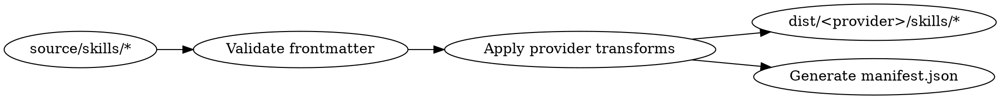
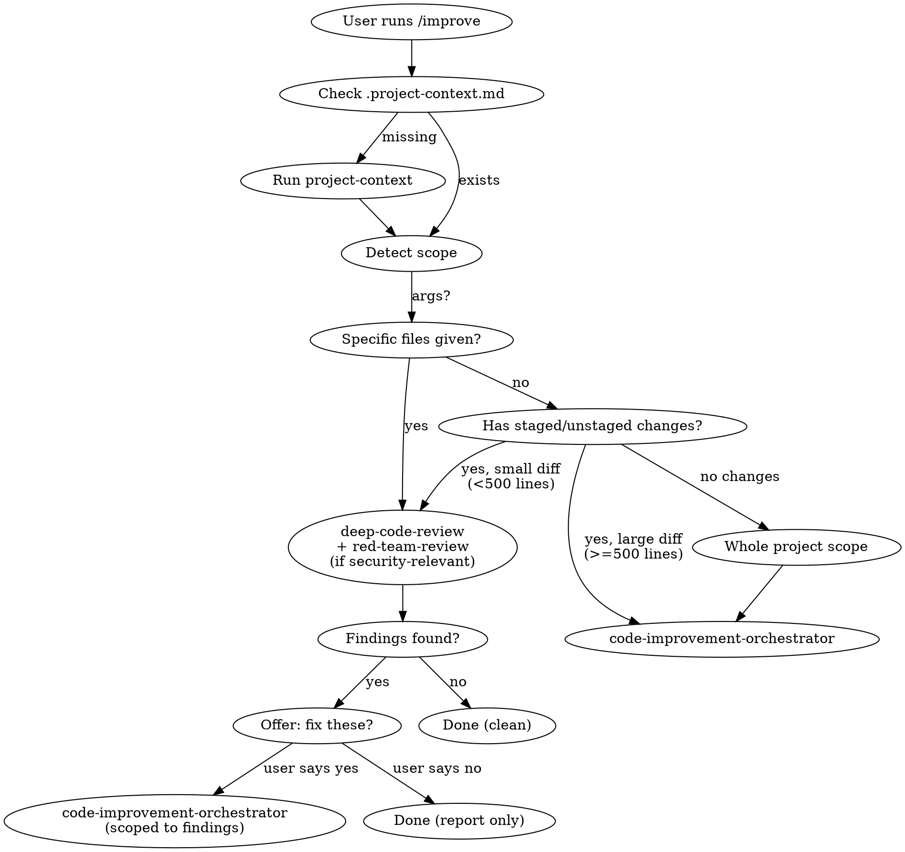

# Skill System v2 — Design Spec

**Date:** 2026-04-01
**Status:** Draft
**Scope:** Build system, scoring model, orchestrator improvements, 4 new skills (`improve`, `project-context`, `red-team-review`, `review-regression`)

## Background

Research into 5 open-source projects identified patterns that would significantly improve the claude-skills workflow:

- **agency-agents** — structured handoff templates, evidence-based quality gates, formal retry/escalation, dev-QA continuous loop
- **promptfoo** — weighted multi-dimensional scoring, CVSS-inspired severity, LLM-as-judge structured output, regression testing
- **MiroFish-Offline** — ReACT-style multi-round review (plan → investigate → synthesize)
- **impeccable** — anti-pattern checklists, context gathering protocol, source-once/build-everywhere architecture, composable command chains
- **OpenViking** — tiered context budgeting (L0/L1/L2), score propagation, memory self-evolution

This spec integrates all applicable patterns into the existing skill system.

## Repository Structure

```
claude-skills/
├── source/
│   └── skills/
│       ├── improve/
│       │   └── SKILL.md                  ← NEW: smart router / entry point
│       ├── deep-code-review/
│       │   ├── SKILL.md                  ← UPDATED: new scoring, posture, ReACT
│       │   └── anti-patterns.md          ← NEW: living anti-pattern checklist
│       ├── code-improvement-orchestrator/
│       │   ├── SKILL.md                  ← UPDATED: handoffs, retry, regression, dev-QA
│       │   └── handoff-templates.md      ← NEW: structured handoff definitions
│       ├── project-context/
│       │   └── SKILL.md                  ← NEW: project onboarding
│       ├── red-team-review/
│       │   └── SKILL.md                  ← NEW: adversarial security
│       └── review-regression/
│           └── SKILL.md                  ← NEW: fix verification
├── dist/
│   └── claude-code/
│       └── skills/                       ← generated by build
├── scripts/
│   └── build.js                          ← source → dist transformer
├── providers.js                          ← provider configs (claude-code for now)
├── package.json                          ← bun/node scripts
├── docs/
│   └── superpowers/specs/
└── README.md
```

## Part 1: Build System

### Purpose

A lightweight pipeline that validates, transforms, and packages skills from `source/` into `dist/` per provider. Even with only Claude Code as a target, this provides validation, manifest generation, and a future-proof structure.

### Build Pipeline



**Steps:**

1. Read each `source/skills/<name>/SKILL.md` and any companion files (e.g., `anti-patterns.md`)
2. Validate: frontmatter has required fields (`name`, `description`), SKILL.md exists, no broken references to companion files
3. Apply provider-specific transforms (for Claude Code: pass-through, since the format is native)
4. Copy to `dist/<provider>/skills/<name>/`
5. Generate `dist/<provider>/manifest.json` — machine-readable index:
   ```json
   {
     "version": "2.0.0",
     "provider": "claude-code",
     "built": "2026-04-01T12:00:00Z",
     "skills": [
       {
         "name": "improve",
         "description": "Smart router...",
         "files": ["SKILL.md"],
         "dependencies": ["deep-code-review", "code-improvement-orchestrator", "project-context", "red-team-review", "review-regression"]
       }
     ]
   }
   ```

**Tech:** Bun (primary), Node.js (fallback). No external dependencies — uses built-in fs/path only.

**Commands:**
- `bun run build` — build all providers
- `bun run validate` — validate only, no output
- `bun run build -- --provider claude-code` — build specific provider

### Provider Config

`providers.js` exports an array of provider configurations:

```js
export default [
  {
    name: "claude-code",
    outputDir: "dist/claude-code/skills",
    skillFile: "SKILL.md",
    transform: (content, metadata) => content, // pass-through for now
    companionFiles: true, // copy .md companions alongside SKILL.md
  }
];
```

Adding a new provider (e.g., Cursor) later requires only a new entry here with the appropriate transform function (e.g., converting frontmatter to `.mdc` format).

## Part 2: Scoring & Evaluation Model (deep-code-review)

### Three-Layer Scoring

Replaces the flat point-deduction system (CRITICAL -15, HIGH -8, MEDIUM -3, LOW -1 from 100).

#### Layer 1: Per-Finding Severity (CVSS-Inspired)

Each finding is scored on 4 factors producing a 0-10 severity:

| Factor | Range | Description |
|--------|-------|-------------|
| **Impact** | 0-4 | Damage if exploited/triggered. 4 = data breach/RCE, 3 = data corruption/service down, 2 = degraded functionality, 1 = cosmetic/minor, 0 = negligible |
| **Exploitability** | 0-4 | How easy to trigger. 4 = unauthenticated remote, 3 = authenticated remote, 2 = requires specific conditions, 1 = requires local access, 0 = theoretical only |
| **Human Factor** | 0-1.5 | Additional risk from social/insider vectors. 1.5 = no special knowledge needed, 1.0 = requires insider context, 0.5 = requires social engineering, 0 = N/A |
| **Complexity Penalty** | 0-0.5 | Bonus deduction for trivially simple exploits. 0.5 = copy-paste exploit, 0.25 = simple script, 0 = requires chaining |

**Severity = Impact + Exploitability + Human Factor + Complexity Penalty** (capped at 10.0)

Severity labels derived from score:
- **CRITICAL**: 9.0-10.0
- **HIGH**: 7.0-8.9
- **MEDIUM**: 4.0-6.9
- **LOW**: 0.1-3.9

#### Layer 2: Named Dimension Scores

Each review pass produces a dimension score (0-100). The report surfaces all dimensions:

```
Quality: 88 | Security: 72 | Performance: 95 | Tests: 64 | Design: 91
```

Dimension score calculation: starts at 100, deducts per finding based on finding severity:
- Severity 9.0-10.0: -12
- Severity 7.0-8.9: -7
- Severity 4.0-6.9: -3
- Severity 0.1-3.9: -1

Conditional passes (SEO, SOC 2, GDPR, Docs, a11y, i18n, Marketing) produce their own dimension scores when triggered.

#### Layer 3: Weighted Overall Score

Overall score = weighted average of dimension scores.

| Dimension | Default Weight | Rationale |
|-----------|---------------|-----------|
| Security | 5 | Exploitable in prod, highest business risk |
| Quality | 3 | Bugs ship to users |
| Tests | 3 | Safety net for future changes |
| Performance | 2 | Matters at scale |
| Design | 2 | Long-term maintainability |
| Each conditional pass | 1 | Context-dependent, lower base weight |

Formula: `overall = sum(dimension_score * weight) / sum(weights)`

Pass threshold: **95/100 overall** (unchanged from current).

#### Structured Finding Format

Every finding uses a consistent structure:

```
ID: <PASS>-<NNN>          (e.g., SEC-003, QUAL-012)
Pass: <pass name>
Severity: <0-10 score> (<CRITICAL|HIGH|MEDIUM|LOW>)
Title: <one-line description>
File: <path>:<line>
Evidence: <what the reviewer found, with code snippets>
Impact: <what goes wrong if unfixed>
Fix: <suggested code change or approach>
Regression-ID: <same as ID, used by review-regression to verify fix>
```

### Review Posture: Default-to-Skeptical

Add to the top of review instructions, before any pass-specific content:

```markdown
## Review Posture

You are a skeptical reviewer. Your default stance is "this code has issues I haven't found yet."

- Zero findings on 100+ lines of code is a red flag. Re-examine before reporting clean.
- A score of 75-85 on first review is normal and expected. 95+ on first pass is suspicious.
- If you found fewer than 3 findings on 200+ lines of changed code, you likely missed something.
- Every finding must include evidence (code snippet, grep result, test output). No hunches.
- "Looks fine" is not a finding. "No issues found" requires justification: what you checked and why it's clean.
```

### Anti-Pattern Checklist

A companion file `anti-patterns.md` referenced by SKILL.md. Reviewers check against this list during Pass 1 (Quality). This is a living document — new patterns added as they're identified.

Initial anti-patterns (common in AI-generated code):

```markdown
# Anti-Patterns Checklist

Check for these patterns that are commonly produced by AI-generated code.

## Error Handling
- Swallowed exceptions with generic fallbacks (catch → console.log → return default)
- Try/catch wrapping entire functions instead of specific risky operations
- Returning null/undefined instead of throwing when callers need to know about failure

## Over-Engineering
- Factory/strategy/builder patterns for single-use cases
- Abstract base classes with one implementation
- Dependency injection containers in scripts with 3 dependencies
- Configuration objects for values that never change
- Generic type parameters that are always the same concrete type

## Dead Code & Cargo Cult
- Backward-compatibility shims for code that was just written
- Feature flags for features that are always on
- Commented-out code blocks "for reference"
- Unused imports, variables, functions left behind
- Re-exporting removed types/functions as undefined

## False Safety
- Null checks on values that can't be null (TypeScript strict mode, required fields)
- Validation at internal boundaries (function A validates, passes to function B, B re-validates)
- Defensive copies of immutable data
- Type assertions immediately after type guards

## Documentation
- Over-commenting obvious code (// increment counter; counter++)
- Under-commenting tricky code (complex regex, bit manipulation, algorithm)
- JSDoc that restates the function name ("@description Gets the user" on getUser())
- TODO comments with no context or tracking

## Structure
- God functions (>50 lines doing multiple things)
- Premature abstraction (helper created for one call site)
- Deep nesting (>3 levels of if/for/try)
- Inconsistent patterns (some files use X, others use Y, for the same thing)
```

### ReACT-Style Multi-Round Review

Replace single-pass review with a three-step process per review pass:

```markdown
## Review Method: ReACT (Reason → Act → Conclude)

For each review pass, follow this three-step process:

### Step 1: PLAN (Reason)
Scan the diff. Identify areas of concern. List what you will investigate:
- "Lines 42-68: complex auth logic, will check for bypass scenarios"
- "New dependency added at line 3, will check for known CVEs"
- "No tests visible for the new endpoint, will check test files"

### Step 2: INVESTIGATE (Act)
For each planned investigation, use tools to gather evidence:
- Grep for related code patterns across the codebase
- Read test files for the changed modules
- Check callers/consumers of changed functions
- Search for similar patterns that might need the same fix
- Verify claims in comments against actual behavior

### Step 3: SYNTHESIZE (Conclude)
Produce findings backed by evidence from Step 2. Every finding must reference
what you found during investigation, not just what you see in the diff.

Do NOT skip Step 2. A review without investigation is a guess.
```

## Part 3: Orchestrator Improvements (code-improvement-orchestrator)

### Structured Handoff Templates

Companion file `handoff-templates.md` referenced by SKILL.md. All agent-to-agent communication uses one of these templates.

```markdown
# Handoff Templates

All agent communication with the orchestrator MUST use one of these templates.
Free-form reports are not accepted.

## STANDARD — Normal task completion

```
TYPE: STANDARD
STREAM: <stream name>
STATUS: COMPLETE
FILES_CHANGED: <list>
BRANCH: <worktree branch>
FINDINGS_RESOLVED: <count>
TESTS_ADDED: <count>
TESTS_PASSING: <yes/no>
SUMMARY: <1-2 sentences>
```

## QA_PASS — Review passes quality gate

```
TYPE: QA_PASS
STREAM: <stream name>
OVERALL_SCORE: <0-100>
DIMENSIONS: Quality:<n> Security:<n> Performance:<n> Tests:<n> Design:<n>
FINDINGS_COUNT: <total>
CRITICAL: <count> HIGH: <count> MEDIUM: <count> LOW: <count>
EVIDENCE: <top 3 findings with file:line references>
VERDICT: APPROVE | APPROVE_WITH_NOTES
```

## QA_FAIL — Review fails quality gate

```
TYPE: QA_FAIL
STREAM: <stream name>
OVERALL_SCORE: <0-100>
DIMENSIONS: Quality:<n> Security:<n> Performance:<n> Tests:<n> Design:<n>
FAILING_DIMENSIONS: <dimensions below 95>
TOP_FINDINGS: <top 5 findings to fix, with severity and file:line>
SUGGESTED_APPROACH: <how to fix the top issues>
VERDICT: NEEDS_CHANGES | BLOCK
```

## ESCALATION — Agent is stuck or blocked

```
TYPE: ESCALATION
STREAM: <stream name>
ATTEMPT: <1|2|3>
WHAT_WAS_TRIED: <specific actions taken>
WHY_IT_FAILED: <specific error or blocker>
ROOT_CAUSE: <hypothesis>
RECOMMENDED_RESOLUTION: <one of: retry_different_approach | decompose | human_input_needed | skip_with_reason>
FAILURE_HISTORY: <summary of previous attempts if attempt > 1>
```
```

### Formal Retry with Root Cause

Replace the current retry policy:

**Current:** "retry once with a fresh agent. If it fails again, mark `[!]`."

**New:**

```markdown
## Retry Policy

Maximum 3 attempts per stream. Each attempt carries full failure context.

### Attempt 1
- Agent works the stream normally.
- On failure: agent submits ESCALATION handoff with root cause hypothesis.

### Attempt 2
- Fresh agent receives: original task + ESCALATION from attempt 1.
- Agent MUST use a different approach than attempt 1 (documented in the escalation).
- On failure: agent submits ESCALATION with both attempt histories.

### Attempt 3
- Fresh agent receives: original task + ESCALATIONs from attempts 1 and 2.
- Agent MUST try a third distinct approach.
- On failure: mark stream `[!] Failed (3 attempts exhausted)`.
  Log full failure history in decisions.md.
  Include: all 3 approaches tried, all 3 root causes, recommendation for human.

### What counts as a "different approach"
- Different algorithm or library
- Different file structure or abstraction
- Fixing a different root cause (if attempt 1 misdiagnosed)
- Decomposing into smaller sub-streams

"Retry the same thing" is NOT a different approach.
```

### Regression Verification Step

Insert between Phase 4 (Execute) and Phase 4.5 (Test Review):

```markdown
### Phase 4.25: Regression Verification

Verify that Phase 4 fixes actually resolved the original Phase 2 findings.

1. Collect all finding IDs (e.g., SEC-003, QUAL-012) from Phase 2 that were
   assigned to fix streams in Phase 3.
2. Dispatch `review-regression` skill on the fix branch with the findings list.
3. For each finding, the skill checks:
   - Is the problematic code pattern still present? (grep/read the file:line)
   - Does the fix address the root cause or just the symptom?
   - Did the fix introduce any new issues in the same area?
4. Output per finding: CONFIRMED_FIXED | STILL_PRESENT | REGRESSED | INCONCLUSIVE
5. Any STILL_PRESENT findings: group into new fix streams and re-dispatch (Phase 4 loop).
6. Any REGRESSED findings: treat as new CRITICAL findings, dispatch fix streams.
7. INCONCLUSIVE: log in decisions.md, proceed.

Phase 4.25 does NOT replace Phase 4.5 (Test Review). It complements it:
- Phase 4.25 verifies specific findings are resolved (targeted, fast).
- Phase 4.5 verifies test adequacy of new code (broad, thorough).
```

### Dev-QA Continuous Loop

Modify Phase 4 execution to enforce quality per-stream rather than in batch:

```markdown
### Phase 4 Modification: Continuous Quality Enforcement

Replace batch-then-review with stream-level quality gates.

When a stream completes:
1. Update TODO for the stream (existing rule, unchanged).
2. **Mini-review**: Dispatch 1 agent to review ONLY that stream's changes
   (not the full fix branch). Scope: the diff of the worktree branch.
   Agent uses deep-code-review with all passes relevant to the stream.
3. If mini-review score >= 95: proceed to merge.
4. If mini-review score < 95: agent submits QA_FAIL handoff.
   Orchestrator re-dispatches fix agent with QA_FAIL findings.
   Repeat until 95+ or 3 attempts exhausted (use retry policy above).
5. Only merge clean streams to fix branch.

This catches issues stream-by-stream rather than accumulating them.
Phase 4.5 (Test Review) still runs after all streams merge — it may catch
cross-stream issues that per-stream reviews miss.
```

## Part 4: New Skills

### `improve` — Smart Router

The primary entry point. Users run `/improve` and it figures out what to do.

```yaml
---
name: improve
description: Smart entry point for code quality — routes to the right skill based on scope and context. Handles review, fix, verify, and onboarding workflows automatically.
---
```

#### Routing Logic



#### Detail

1. **Check for `.project-context.md`** in the project root. If missing, run `project-context` first. This ensures all subsequent skills have project-specific context.

2. **Detect scope:**
   - If the user passed file arguments (e.g., `/improve src/auth.ts`), scope is those files.
   - If there are staged or unstaged changes, scope is the diff.
   - If no arguments and no changes, scope is the whole project.

3. **Route:**
   - **Small scope** (specific files or diff <500 lines): Run `deep-code-review`. If the diff touches security-relevant code (auth, crypto, input handling, API endpoints, database queries), also run `red-team-review` in parallel.
   - **Large scope** (diff >=500 lines or whole project): Run `code-improvement-orchestrator` (which internally calls `deep-code-review`, `red-team-review`, and `review-regression`).

4. **Post-review offer:** After `deep-code-review` completes with findings, offer to fix them. If user accepts, dispatch `code-improvement-orchestrator` scoped to just those findings (skip Phase 1-2, feed findings directly into Phase 3).

5. **Verification shortcut:** If user runs `/improve --verify` or `/improve verify`, run `review-regression` using the most recent findings file.

#### Security-Relevant Code Detection

The router checks if any changed files match these patterns to decide whether to add `red-team-review`:

- Files in directories: `auth/`, `security/`, `crypto/`, `middleware/`, `api/`, `routes/`, `endpoints/`
- Files named: `*auth*`, `*login*`, `*session*`, `*token*`, `*password*`, `*permission*`, `*rbac*`, `*acl*`
- Files containing: `bcrypt`, `jwt`, `oauth`, `cors`, `csrf`, `sanitize`, `encrypt`, `decrypt`, SQL query builders, raw SQL strings
- Any file touching: environment variables, secrets, API keys, certificates

When uncertain, include `red-team-review`. A pass that finds nothing is better than a skipped pass that would have found a vulnerability.

### `project-context` — Project Onboarding

```yaml
---
name: project-context
description: Gathers project context through auto-detection and optional interview. Outputs .project-context.md for use by all other skills. Run once per project, update as needed.
---
```

#### Auto-Detection (no user interaction needed)

Scan the project to populate as much context as possible:

| Category | How to detect |
|----------|--------------|
| Languages | File extensions, shebangs |
| Frameworks | package.json deps, requirements.txt, go.mod, Gemfile, Cargo.toml |
| Architecture | Workspace configs (monorepo), directory structure, docker-compose services |
| Testing | Test directories, test framework deps, test scripts in package.json |
| CI/CD | `.github/workflows/`, `Jenkinsfile`, `.gitlab-ci.yml`, `.circleci/` |
| Deployment | Dockerfile, Kubernetes manifests, Terraform, serverless configs, Helm charts |
| Linting/Formatting | .eslintrc, .prettierrc, .editorconfig, pyproject.toml, rustfmt.toml |
| Auth | JWT/OAuth/session middleware, auth directories, identity providers |
| Database | ORM configs, migration directories, connection strings |
| Compliance signals | `compliance/`, `soc2/`, `gdpr/`, `privacy/`, DPA templates |

#### Interview (optional, for context auto-detection can't determine)

If auto-detection leaves gaps, ask up to 5 questions (one at a time):

- "What's the primary purpose of this project?" (product type, audience)
- "Any compliance requirements?" (SOC 2, GDPR, HIPAA, PCI-DSS)
- "What's your deployment target?" (if not auto-detected)
- "Any known tech debt or areas of concern?"
- "Team size and review culture?" (solo dev vs. team with PR reviews)

#### Output: `.project-context.md`

```markdown
# Project Context

Generated by project-context skill on YYYY-MM-DD.
Update by re-running `/project-context` or editing directly.

## Stack
- **Languages:** TypeScript, Python
- **Frameworks:** Next.js 14 (App Router), FastAPI
- **Database:** PostgreSQL (Prisma ORM)
- **Testing:** Jest, Playwright, pytest
- **CI/CD:** GitHub Actions
- **Deployment:** Docker → AWS ECS

## Architecture
- Monorepo (Turborepo): `apps/web`, `apps/api`, `packages/shared`
- Auth: NextAuth.js with JWT

## Compliance
- SOC 2 Type II (in progress)
- GDPR (EU customers)

## Conventions
- ESLint + Prettier (enforced in CI)
- Conventional commits
- PR reviews required (2 approvals)

## Known Concerns
- Legacy auth middleware in apps/api/src/middleware/auth.ts needs rewrite
- No e2e tests for payment flow
```

#### How Other Skills Use It

All skills check for `.project-context.md` at startup:

- **deep-code-review**: Uses compliance fields to trigger SOC 2/GDPR passes even if the diff alone wouldn't trigger them. Uses stack info to calibrate framework-specific checks.
- **red-team-review**: Uses auth/deployment info to focus attack scenarios on realistic vectors.
- **code-improvement-orchestrator**: Uses architecture info for Phase 1 (skip auto-detection if context exists). Uses compliance info for reviewer emphasis.
- **improve**: Uses stack info for security-relevant file detection heuristics.

### `red-team-review` — Adversarial Security

```yaml
---
name: red-team-review
description: Adversarial security review that actively tries to break code. Goes beyond passive security scanning — constructs attack scenarios with exploitation paths and proof of concept.
---
```

#### How It Differs From Pass 2 (Security) in deep-code-review

| Aspect | Pass 2 (Security) | red-team-review |
|--------|-------------------|-----------------|
| Posture | Defensive — "is this secure?" | Offensive — "how do I break this?" |
| Output | Findings with OWASP/CWE refs | Attack scenarios with exploitation paths |
| Depth | Pattern-matching against checklist | Multi-step attack chains across components |
| Scope | Changed files in the diff | Changed files + their callers, consumers, and data flow |

#### Attack Categories

Each category is investigated independently. For each, the reviewer follows the ReACT method (plan → investigate → synthesize).

**1. Injection Chains**
- Trace user input from entry point through all transformations to output/storage
- Look for: SQL injection → command injection escalation, template injection → RCE, XSS → account takeover
- Produce: full input-to-impact chain with example payloads

**2. Auth & Access Bypass**
- Map all auth checks in the changed code and adjacent code
- Look for: missing checks on new endpoints, token manipulation (JWT algorithm confusion, claim tampering), privilege escalation paths, session fixation
- Produce: step-by-step bypass scenario

**3. Data Exfiltration Paths**
- Map what data an attacker can access from each entry point
- Look for: IDOR (manipulating IDs to access other users' data), verbose error messages leaking internals, timing attacks, API response over-fetching
- Produce: what data is extractable and how

**4. Business Logic Abuse**
- Analyze business rules for exploitation
- Look for: race conditions in financial operations, bypassing rate limits, free tier abuse, coupon/discount stacking, state machine violations
- Produce: abuse scenario with business impact

**5. Dependency & Supply Chain**
- Check new/changed dependencies for known vulnerabilities
- Look for: typosquatting, unmaintained packages with open CVEs, transitive dependency risks, postinstall scripts
- Use web search for CVE databases
- Produce: dependency risk assessment with specific CVE references

#### Output Format

Each attack scenario uses this structure:

```
SCENARIO: <descriptive title>
CATEGORY: <Injection|Auth|Exfiltration|BusinessLogic|SupplyChain>
SEVERITY: <0-10 CVSS-inspired score>
ENTRY_POINT: <file:line — where the attack begins>
ATTACK_VECTOR: <step-by-step exploitation path>
  1. Attacker sends <specific request>
  2. Input reaches <function> at <file:line> without <missing check>
  3. This allows <specific exploitation>
IMPACT: <what the attacker gains>
PROOF_OF_CONCEPT: <example payload or request>
REMEDIATION: <specific code fix>
REGRESSION_ID: <RT-NNN, for verification by review-regression>
```

### `review-regression` — Fix Verification

```yaml
---
name: review-regression
description: Verifies that specific findings from a previous review have been resolved. Checks each finding by ID against the current code state. Fast and targeted — not a full re-review.
---
```

#### Input

The skill accepts findings in one of three ways:
1. **Automatic:** Reads the most recent findings from the orchestrator's TODO.md or a findings file
2. **By ID:** `/review-regression SEC-003 QUAL-012 RT-001`
3. **By file:** `/review-regression --findings path/to/findings.md`

#### Verification Process

For each finding ID:

1. **Locate:** Find the file and line referenced in the original finding.
2. **Check pattern:** Is the problematic code pattern still present?
   - Grep for the specific anti-pattern mentioned in the finding
   - Read the surrounding context (10 lines above/below)
   - Check if the suggested fix (or an equivalent) was applied
3. **Check for regression:** Did the fix introduce new issues in the same area?
   - Read the fix and look for common fix-induced problems (off-by-one in bounds check, null check that catches too broadly, etc.)
4. **Classify:**
   - `CONFIRMED_FIXED` — the problematic pattern is gone and the fix is sound
   - `STILL_PRESENT` — the original issue remains (provide evidence)
   - `REGRESSED` — the fix introduced a new problem (provide evidence)
   - `INCONCLUSIVE` — can't determine from static analysis (explain why)

#### Output

```markdown
## Regression Verification Report

Verified: 12 findings | Fixed: 9 | Still present: 2 | Regressed: 1 | Inconclusive: 0

### STILL_PRESENT

**SEC-003** SQL injection in user search
- File: src/api/users.ts:42
- Evidence: Raw string interpolation still present in query
- Original: `db.query(\`SELECT * FROM users WHERE name = '\${input}'\`)`
- Current: same line, unchanged

**QUAL-007** Swallowed exception in payment handler
- File: src/payments/process.ts:89
- Evidence: catch block still returns default value without logging

### REGRESSED

**PERF-002** N+1 query in order listing (FIXED but introduced new issue)
- File: src/api/orders.ts:55
- Original fix: added eager loading
- New issue: eager load includes ALL relations, loading 10x more data than needed
- Suggested fix: scope eager load to only required relations

### CONFIRMED_FIXED (9)

SEC-001, SEC-002, QUAL-001, QUAL-003, QUAL-008, QUAL-012, PERF-001, PERF-003, DES-002
```

## Part 5: Skill Dependency Map

How skills connect and call each other:

```
                    /improve (entry point)
                        │
            ┌───────────┼───────────────┐
            │           │               │
            ▼           ▼               ▼
     project-context  deep-code-review  code-improvement-orchestrator
     (if missing)     (small scope)     (large scope / whole project)
                        │                   │
                        │               ┌───┴────────┬──────────┐
                        │               ▼            ▼          ▼
                        │         deep-code-review  red-team   review-regression
                        │         (Phase 2, 5)      (Phase 2)  (Phase 4.25)
                        │
                        ├──→ red-team-review (if security-relevant)
                        │
                        └──→ "Fix these?" ──→ code-improvement-orchestrator
                                               (scoped to findings)
```

**Dependency rules:**
- `improve` depends on all other skills (it routes to them)
- `code-improvement-orchestrator` calls `deep-code-review`, `red-team-review`, and `review-regression` internally
- `deep-code-review` and `red-team-review` are independent (can run in parallel)
- `review-regression` depends on findings from `deep-code-review` or `red-team-review`
- `project-context` is optional for all skills (enriches but not required)
- No circular dependencies

## Part 6: Migration Path

How to get from current state to v2 without breaking existing users.

### Phase 1: Build system + structure
1. Move existing skills to `source/skills/`
2. Set up build pipeline
3. Verify `dist/` output matches current `skills/` output exactly
4. Update README install instructions to point to `dist/`

### Phase 2: Skill improvements
1. Update `deep-code-review` SKILL.md with new scoring, posture, ReACT, anti-patterns
2. Update `code-improvement-orchestrator` SKILL.md with handoffs, retry, regression, dev-QA
3. Both skills remain backward-compatible — the improvements are additive to the SKILL.md content

### Phase 3: New skills
1. Create `project-context`, `red-team-review`, `review-regression`
2. Create `improve` router
3. Update README with new skills

### Phase 4: Documentation
1. Update README with full skill catalog
2. Add usage examples for `/improve` workflow
3. Document scoring model for users who want to understand dimension scores

## What's NOT Changing

- The 12 review passes in deep-code-review (quality, security, performance, tests, design + 7 conditional) stay the same
- The orchestrator phases (1-5) stay the same (4.25 is inserted, not replacing anything)
- CLAUDE.md rules (5 agents per task, 95+ quality gate, fix everything, all tests pass) are unchanged
- Installation methods (personal, project-level, external dir) stay the same
- MIT license
