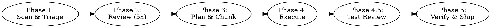

# Code Improvement Orchestrator

## Overview

An autonomous code improvement workflow that reviews, plans, and fixes quality issues across a project. The orchestrator is a **conductor** — it dispatches subagents for code changes, manages TODO tracking, and coordinates parallel work. It does not directly edit source files in the target project; it writes coordination artifacts (TODO.md, decisions.md, status updates) and dispatches subagents for all source code modifications. Trivial one-line fixes may be done directly.

**Core rules:**
- **Fix everything you can.** The ONLY reason to defer a finding is if it genuinely requires human input (missing credentials, unclear business requirements, access you don't have). If you can fix it, fix it — regardless of severity. Do NOT dump fixable work into the PR description.
- One PR per repo at the end — no intermediate PRs
- TODO always updated: `[ ]` pending, `[-]` in progress, `[x]` done, `[!]` blocked/deferred
- **Minimum 5 reviewers** for every review task — code reviews, plan reviews, spec reviews. Treat each reviewer as a human reviewer: thorough, independent, no shortcuts.
- Maximize parallel work — up to 8 subagents at a time, batch remaining
- Human never blocks work — defer and make sensible assumptions, log in `decisions.md`
- **Every question to the human must include:** (1) what the industry standard is, (2) your recommendation and why. Never ask a bare question — always help the human decide by providing context and your opinion. This applies to all questions: architecture decisions, ambiguous requirements, blocked items, and deferred decisions.
- All new code must have tests; bugs must have regression tests
- **ALL tests must pass before ANY PR or merge.** There is no such thing as "pre-existing failures." If tests fail, fix them FIRST — before merging anything, before creating PRs, before moving to the next phase. A reviewer would reject a PR with failing tests. So do you. Zero tolerance.
- Search the web when needed (CVEs, API docs, best practices)
- Use any available skill when relevant (soft dependencies — skip if unavailable)
- Fix branch: `fix/orchestrator-YYYY-MM-DD`

**Definitions:**
- **Review target**: A package identified during Phase 1 project structure detection. A single-package project has 1 review target. A monorepo has N review targets (one per package).
- **Phase-boundary status print**: The status table printed once at the end of a phase, after all work in that phase is complete. Distinct from per-stream prints during Phase 4.
- **Test-fix cycle**: (1) Dispatch subagents to address all actionable test findings, (2) wait for all subagents to complete and merge, (3) re-review. Repeat until all findings are resolved or only `[!]` items needing human input remain.

## When to Use

- When asked to review and improve a whole codebase
- When asked to run a comprehensive quality/security/performance pass
- When asked to fix all issues across a project

**When NOT to use:**
- Single file reviews (use `/deep-code-review` directly)
- One specific bug fix (just fix it)

## The Workflow



### Phase 1: Scan & Triage

1. **Detect project structure** — identify packages, tech stack, existing TODO files, CLAUDE.md files. For monorepos, check for `workspaces` in `package.json`, `pnpm-workspace.yaml`, `settings.gradle`, or multiple independent package directories.
2. **Identify human questions** — scan for things needing human input (missing env vars, unclear architecture, access issues). Present all questions upfront in a batch. For each question, include: what the industry standard is, your recommendation, and why. Never ask a bare question.
3. **Create `decisions.md`** at project root — log assumptions here. Format: `### [Phase] — [title]` followed by what was assumed, alternatives considered, and risk level (LOW/MEDIUM/HIGH). Only log MEDIUM and HIGH risk assumptions. LOW-risk defaults are silent.
4. **Detect or create `TODO.md`** — find existing TODO file or create one at project root. Use markdown checklist format.
5. **Categorize work** — split into "can proceed" and "needs human." Work on unblocked items immediately. Make sensible assumptions for deferred items, log in `decisions.md`, continue.

**Verify TODO before status table** — read TODO.md. For Phase 1, this is trivially satisfied if TODO.md was just created. For resume scenarios where TODO.md already exists, verify all items reflect actual status before printing.

**Print status table after this phase.**

```
## Phase 1 Completion
- [ ] Project structure detected — write: [number] packages, [tech stack]
- [ ] Human questions batched and presented (or none needed)
- [ ] decisions.md created at project root
- [ ] TODO.md detected or created — write: [path]
- [ ] Work categorized into "can proceed" and "needs human"
- [ ] TODO verified current (GATE)
- [ ] Status table printed
```

### Phase 2: Review (5 Parallel Passes)

1. **Dispatch 5 independent subagents in parallel** — each runs a full `/deep-code-review` on the same codebase. Five separate agents provide strong variation in what gets caught — each acts as an independent human reviewer. For monorepos, each package gets 5 passes — dispatch all concurrently (max 8 at a time, batch remaining).
2. **Agents search the web** when needed and use any relevant available skill.
3. **Count review results** — write the number of completed review results per review target. If any review target has fewer than 5 results, STOP and dispatch the missing agents. Wait for completion. Do NOT consolidate with fewer than 5 results per target.
4. **Consolidate findings** once all agents complete. A single consolidation pass:
   - **Dedup:** same file + line range + same issue category = duplicate. Keep one, take higher severity.
   - **Fix conflicts:** if agents suggest different fixes for same issue, include both as alternatives.
   - **All findings survive** regardless of how many agents flagged them — a finding from 1-of-5 is valid.
5. **Update TODO** — write all consolidated findings as `[ ]` items, grouped by severity.

**Verify TODO before status table** — read TODO.md. Verify all findings are recorded. No current-phase item should still be `[-]` at this point — update any stale items. Do NOT print the status table until TODO.md is current.

**Print status table after this phase.**

```
## Phase 2 Completion
- [ ] 5 review results received per review target (GATE) — write: [count] results for [target]
- [ ] Findings consolidated (deduped, conflicts noted)
- [ ] TODO.md updated with all findings by severity (GATE)
- [ ] Status table printed
```

### Phase 3: Plan & Chunk

1. **Group findings into work streams** — cluster related findings (e.g., all auth issues, all performance issues). Each stream is an independent unit of work.
2. **Build dependency graph** — streams touching different files/packages run concurrently. Streams touching the same package are sequenced by default (conservative — avoids merge conflicts).
3. **Create a plan per stream** — dispatch 5 subagents to review each plan. Each reviewer acts as an independent human reviewer — thorough, no shortcuts. Keep reviewing until all issues are resolved, then surface to human only if genuinely unresolvable.
4. **Assign priority** — CRITICAL/HIGH first, then MEDIUM, then LOW.
5. **Branch setup** — create `fix/orchestrator-YYYY-MM-DD` per repo. Subagents get worktrees off this branch (orchestrator creates them).
6. **Update TODO** — add stream sub-items under each finding.

**Verify TODO before status table** — read TODO.md. Verify all stream sub-items are recorded. No current-phase item should still be `[-]` — update any stale items. Do NOT print the status table until TODO.md is current.

**Print status table after this phase.**

```
## Phase 3 Completion
- [ ] Findings grouped into work streams
- [ ] Dependency graph built (parallel vs sequential)
- [ ] Plans created and reviewed (5 subagents per plan, all issues resolved)
- [ ] Priority assigned (CRITICAL/HIGH first)
- [ ] Fix branch created — write: [branch name]
- [ ] TODO.md updated with stream sub-items (GATE)
- [ ] Status table printed
```

### Phase 4: Execute

1. **Dispatch subagents per stream, in parallel** — each gets a worktree and a plan. Orchestrator only coordinates.
2. **Testing** — all new code must have tests. Bugs must include regression tests. Use TDD where appropriate (failing test first, then fix).
3. **Subagents report status back** to the orchestrator. The orchestrator is the **single writer** for TODO.md and decisions.md — subagents never write to these files directly.
4. **Update TODO on stream completion** — when a subagent reports a stream complete, update TODO.md for that stream FIRST, before merging, dispatching, or any other action. If multiple streams complete simultaneously, update TODO.md for ALL completed streams before performing any merges or dispatches. Process completions in batch: all TODO updates first, then all merges, then all new dispatches.
5. **Blocked work** — if a subagent hits a blocker, it reports back. Orchestrator logs assumption in `decisions.md` and re-dispatches or defers.
6. **Merge to fix branch** — as each stream completes (and after TODO is updated per step 4), orchestrator rebases the worktree branch onto the fix branch. Merge queue is sequential (first-finished-first-merged). If rebase has conflicts, dispatch a subagent to resolve. If unresolvable (>3 conflict files), defer to human.
7. **Skill usage** — subagents use TDD, systematic-debugging, simplify, webapp-testing, or any other relevant skill as needed.

**Print status table after each stream completes** (per-stream prints during execution).

**Verify TODO before final status table** — at the end of Phase 4, read TODO.md. All Phase 4 items must be `[x]` (completed) or `[!]` (blocked/deferred). No item should still be `[-]`. Update any stale items before printing the phase-boundary status table.

**Print phase-boundary status table.**

```
## Phase 4 Completion
- [ ] All streams dispatched and completed (or deferred)
- [ ] TODO.md updated after each stream (GATE)
- [ ] All worktree branches merged to fix branch
- [ ] Blocked/failed streams logged in decisions.md
- [ ] TODO verified current (GATE)
- [ ] Status table printed
```

### Phase 4.5: Test Adequacy Review

Verifies that Phase 4 actually followed the "all new code must have tests" rule.

**Short-circuit:** If Phase 4 produced no code changes (all streams deferred/blocked/documentation-only), note this in TODO.md and proceed directly to Phase 5. Do not dispatch the review subagent.

1. **Review:** Dispatch 1 subagent to review test code on the fix branch. The subagent reviews the diff between the fix branch and the branch point (`git diff main...fix/orchestrator-YYYY-MM-DD`). All modified or added files in this diff are in scope. Pre-existing untouched files are out of scope. A single reviewer is sufficient — unlike Phase 2 where variation catches different issues in unfamiliar code, Phase 4.5 reviews tests against known fix specifications, making the task more constrained.

   The subagent receives this review checklist:

   | Category | What to Look For |
   |----------|-----------------|
   | Coverage gaps | New/modified code paths without corresponding tests |
   | Weak assertions | Tests that pass but don't verify meaningful behavior (no assertions, asserting on mocks, tautological checks) |
   | Missing edge cases | Only happy path tested — no empty input, null, boundary, error, concurrent scenarios |
   | Regression gaps | Bug fixes from Phase 4 without regression tests proving the bug is caught |
   | Test isolation | Shared mutable state, order-dependent tests, tests hitting real services |
   | False confidence | High line coverage but low behavioral coverage — tests exercise code without verifying outcomes |

2. **Findings** are written back to the orchestrator.
3. **Update TODO** with test findings.
4. **Fix:** If findings exist, dispatch subagents to write/fix the tests. Each test-fix subagent gets its own worktree off the fix branch. Test-fix streams for different packages run in parallel; streams touching the same package run sequentially. No separate dependency graph is needed — the parallelism rule is applied directly. Merge-to-fix-branch procedure, retry policy, and failure handling are identical to Phase 4.
5. Each test-fix cycle must fully complete (all streams merged to fix branch) before the next cycle's review begins.
6. **Keep fixing until all findings are resolved.** Continue dispatching test-fix cycles until all actionable findings are addressed. Only stop if a finding genuinely requires human input — mark it `[!]` and log in `decisions.md`.

**No test infrastructure:** If the project has no existing test infrastructure, the review subagent should note this. Treat test framework setup as a single prerequisite stream dispatched before test-writing streams.

**Verify TODO before status table** — read TODO.md. All Phase 4.5 items must be `[x]` (completed) or `[!]` (needs human). Update any stale items.

**Print status table after this phase.**

```
## Phase 4.5 Completion
- [ ] Test adequacy review dispatched on fix branch (1 subagent)
- [ ] All findings fixed (only `[!]` items needing human remain)
- [ ] TODO.md updated (GATE)
- [ ] Status table printed
```

### Phase 5: Verify & Ship

1. **Final review pass** — dispatch a fresh subagent to run `/deep-code-review` on each repo's fix branch. This covers all changes including Phase 4 fixes and Phase 4.5 tests.
2. **New findings** — ALL findings (CRITICAL, HIGH, MEDIUM, LOW) trigger fix cycles. Fix everything you can. Only defer findings that genuinely require human input — mark those `[!]` and log in `decisions.md`. Keep cycling until all fixable findings are resolved.
3. **Decisions review** — if human is present, present `decisions.md` for review. Fix any rejected assumptions before PR.
4. **One PR per repo** — create from fix branch targeting the repo's default branch. PR description includes: summary of changes, findings addressed by severity, test coverage added, link to `decisions.md` if assumptions were made. The only "remaining items" in the PR should be `[!]` items that genuinely need human input.
5. **Cleanup** — delete worktrees, update TODO (all completed items `[x]`), commit.

**Verify TODO before final status table** — read TODO.md. All items must be `[x]`. Update any stale items.

**Print final status table.**

```
## Phase 5 Completion
- [ ] Full test suite passes — ALL tests green, zero failures (GATE)
- [ ] Final deep-code-review on fix branch (covers all changes including Phase 4.5 tests)
- [ ] ALL findings fixed — CRITICAL, HIGH, MEDIUM, LOW (only `[!]` needing human remain)
- [ ] decisions.md presented to human (if present)
- [ ] One PR per repo created
- [ ] Worktrees cleaned up
- [ ] TODO.md fully resolved — all items [x] (GATE)
- [ ] Final status table printed
```

## Status Table

Print after every phase completion, stream completion, or error:

```
| # | Stream            | Package  | Status         | Findings |
|---|-------------------|----------|----------------|----------|
| 1 | Auth fixes        | service  | [x] Done       | 4/4      |
| 2 | SEO metadata      | app      | [-] In progress | 2/5      |
| 3 | Performance       | app      | [ ] Queued     | 3        |
| 4 | Infra cleanup     | infra    | [!] Blocked    | Human    |
| 5 | (test) Auth tests | service  | [x] Done       | 2/2      |
| 6 | (test) SEO tests  | app      | [-] In progress | 1/3      |
```

Phase 4.5 test-fix streams appear in the same table with a `(test)` prefix to distinguish them from Phase 4 execution streams.

## Continuous Review (Not Just at the End)

Reviews are not a final gate — they happen throughout the workflow to ensure consistency:

- **Phase 2**: 5 independent code reviews per review target
- **Phase 3**: 5 reviewers per plan before execution begins — catch design issues before writing code
- **Phase 4**: Each stream's subagent uses TDD and relevant skills during development — review is baked into the work, not bolted on after
- **Phase 4.5**: Test adequacy review catches gaps in what Phase 4 produced
- **Phase 5**: Final comprehensive review on the complete fix branch

Every review step uses a minimum of 5 independent subagents acting as human reviewers. This applies to code reviews, plan reviews, spec reviews, and any other review task dispatched by the orchestrator. No exceptions.

## Resume Procedure

If the orchestrator is interrupted mid-execution:

- Fix branch and worktrees survive on disk (not deleted)
- On restart, read TODO.md to determine completed (`[x]`) vs. pending (`[ ]`) work
- Resume from the earliest incomplete phase
- Print status table showing what was completed and what remains

## Failure & Retry

- **Subagent failure:** retry once with a fresh agent. If it fails again, mark stream `[!] Failed`, log in `decisions.md`, continue with other streams.
- **Merge conflict unresolvable:** mark stream `[!] Conflict`, preserve worktree, defer to human.

## Files Created/Modified

- **`decisions.md`** (project root) — assumptions log, MEDIUM/HIGH risk only
- **`TODO.md`** (project root or existing) — findings and progress tracking
- **Fix branch** (`fix/orchestrator-YYYY-MM-DD`) — all changes here
- **Worktrees** (temporary) — one per stream, cleaned up after merge

## Common Mistakes

| Mistake | Fix |
|---------|-----|
| Writing code directly instead of dispatching subagents | Orchestrator coordinates only. Dispatch subagents for all source changes. |
| Letting subagents write to TODO.md or decisions.md | Single-writer pattern. Only the orchestrator writes tracking files. |
| Creating intermediate PRs | One PR per repo at the end. No exceptions. |
| Skipping tests for fixes | All new code needs tests. Bugs need regression tests. Phase 4.5 will verify. |
| Blocking on human questions | Defer, make sensible assumptions, log in decisions.md, continue. |
| Dumping fixable findings into PR description | Fix ALL findings you can — CRITICAL, HIGH, MEDIUM, LOW. Only `[!]` items needing human input belong in the PR as remaining work. |
| Sequencing work that could run in parallel | Check the dependency graph. Different packages = parallel. Same package = sequential. |
| Having fewer than 5 review results before consolidating | GATE: Write the count per review target. Must be exactly 5. Re-dispatch if short. |
| Proceeding with stale TODO.md | GATE: Read and verify TODO.md before every phase-boundary status table print. |
| Moving to next stream without updating TODO | GATE: Update TODO for completed stream before any other action. Batch if multiple complete simultaneously. |
| Skipping Phase 4.5 test review | Phase 4.5 is mandatory unless Phase 4 produced no code changes. |
| Reviewing entire test suite in Phase 4.5 | Scope to fix branch diff only. Don't audit pre-existing test debt. |
| Logging fixable test gaps to PR instead of fixing them | Keep fixing until all test findings are resolved. Only defer what needs human input. |
| Dismissing test failures as "pre-existing" | There is no such thing. If tests fail, fix them before merging or creating PRs. A reviewer would reject it — so do you. |
| Merging with failing tests | ALL tests must be green before ANY merge or PR. Zero tolerance. Fix failures first, then proceed. |
