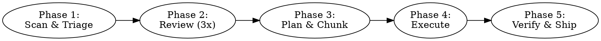

# Code Improvement Orchestrator

## Overview

An autonomous code improvement workflow that reviews, plans, and fixes quality issues across a project. The orchestrator is a **conductor** — it dispatches subagents for code changes, manages TODO tracking, and coordinates parallel work. It does not directly edit source files in the target project; it writes coordination artifacts (TODO.md, decisions.md, status updates) and dispatches subagents for all source code modifications. Trivial one-line fixes may be done directly.

**Core rules:**
- One PR per repo at the end — no intermediate PRs
- TODO always updated: `[ ]` pending, `[-]` in progress, `[x]` done
- Maximize parallel work — up to 6 subagents at a time, batch remaining
- Human never blocks work — defer and make sensible assumptions, log in `decisions.md`
- All new code must have tests; bugs must have regression tests
- Search the web when needed (CVEs, API docs, best practices)
- Use any available skill when relevant (soft dependencies — skip if unavailable)
- Fix branch: `fix/orchestrator-YYYY-MM-DD`

## When to Use

- When asked to review and improve a whole codebase
- When asked to run a comprehensive quality/security/performance pass
- When asked to fix all issues across a project

**When NOT to use:**
- Single file reviews (use `/deep-code-review` directly)
- One specific bug fix (just fix it)

## The Workflow



### Phase 1: Scan & Triage

1. **Detect project structure** — identify packages, tech stack, existing TODO files, CLAUDE.md files. For monorepos, check for `workspaces` in `package.json`, `pnpm-workspace.yaml`, `settings.gradle`, or multiple independent package directories.
2. **Identify human questions** — scan for things needing human input (missing env vars, unclear architecture, access issues). Present all questions upfront in a batch.
3. **Create `decisions.md`** at project root — log assumptions here. Format: `### [Phase] — [title]` followed by what was assumed, alternatives considered, and risk level (LOW/MEDIUM/HIGH). Only log MEDIUM and HIGH risk assumptions. LOW-risk defaults are silent.
4. **Detect or create `TODO.md`** — find existing TODO file or create one at project root. Use markdown checklist format.
5. **Categorize work** — split into "can proceed" and "needs human." Work on unblocked items immediately. Make sensible assumptions for deferred items, log in `decisions.md`, continue.

**Print status table after this phase.**

### Phase 2: Review (3 Parallel Passes)

1. **Dispatch 3 independent subagents in parallel** — each runs a full `/deep-code-review` on the same codebase. Three separate agents provide natural variation in what gets caught. For monorepos, each package gets 3 passes — dispatch all concurrently (max 6 at a time, batch remaining).
2. **Agents search the web** when needed and use any relevant available skill.
3. **Consolidate findings** once all agents complete. A single consolidation pass:
   - **Dedup:** same file + line range + same issue category = duplicate. Keep one, take higher severity.
   - **Fix conflicts:** if agents suggest different fixes for same issue, include both as alternatives.
   - **All findings survive** regardless of how many agents flagged them — a finding from 1-of-3 is valid.
4. **Update TODO** — write all consolidated findings as `[ ]` items, grouped by severity.

**Print status table after this phase.**

### Phase 3: Plan & Chunk

1. **Group findings into work streams** — cluster related findings (e.g., all auth issues, all performance issues). Each stream is an independent unit of work.
2. **Build dependency graph** — streams touching different files/packages run concurrently. Streams touching the same package are sequenced by default (conservative — avoids merge conflicts).
3. **Create a plan per stream** — dispatch 3 subagents to review each plan. Max 3 review cycles per plan, then surface to human if unresolved.
4. **Assign priority** — CRITICAL/HIGH first, then MEDIUM, then LOW.
5. **Branch setup** — create `fix/orchestrator-YYYY-MM-DD` per repo. Subagents get worktrees off this branch (orchestrator creates them).
6. **Update TODO** — add stream sub-items under each finding.

**Print status table after this phase.**

### Phase 4: Execute

1. **Dispatch subagents per stream, in parallel** — each gets a worktree and a plan. Orchestrator only coordinates.
2. **Testing** — all new code must have tests. Bugs must include regression tests. Use TDD where appropriate (failing test first, then fix).
3. **Subagents report status back** to the orchestrator. The orchestrator is the **single writer** for TODO.md and decisions.md — subagents never write to these files directly.
4. **Blocked work** — if a subagent hits a blocker, it reports back. Orchestrator logs assumption in `decisions.md` and re-dispatches or defers.
5. **Merge to fix branch** — as each stream completes, orchestrator rebases the worktree branch onto the fix branch. Merge queue is sequential (first-finished-first-merged). If rebase has conflicts, dispatch a subagent to resolve. If unresolvable (>3 conflict files), defer to human.
6. **Skill usage** — subagents use TDD, systematic-debugging, simplify, webapp-testing, or any other relevant skill as needed.

**Update TODO and print status table after each stream completes.**

### Phase 5: Verify & Ship

1. **Final review pass** — dispatch a fresh subagent to run `/deep-code-review` on each repo's fix branch.
2. **New findings** — only CRITICAL and HIGH findings trigger another fix cycle (plan, execute, verify). MEDIUM and LOW go into the PR description as known items. Max 3 verify-fix cycles total — after that, remaining items go into the PR.
3. **Decisions review** — if human is present, present `decisions.md` for review. Fix any rejected assumptions before PR.
4. **One PR per repo** — create from fix branch targeting the repo's default branch. PR description includes: summary of changes, findings addressed by severity, test coverage added, remaining items, link to `decisions.md` if assumptions were made.
5. **Cleanup** — delete worktrees, update TODO (all completed items `[x]`), commit.

**Print final status table.**

## Status Table

Print after every phase completion, stream completion, or error:

```
| # | Stream          | Package  | Status         | Findings |
|---|-----------------|----------|----------------|----------|
| 1 | Auth fixes      | service  | [x] Done       | 4/4      |
| 2 | SEO metadata    | app      | [-] In progress | 2/5      |
| 3 | Performance     | app      | [ ] Queued     | 3        |
| 4 | Infra cleanup   | infra    | [!] Blocked    | Human    |
```

## Resume Procedure

If the orchestrator is interrupted mid-execution:

- Fix branch and worktrees survive on disk (not deleted)
- On restart, read TODO.md to determine completed (`[x]`) vs. pending (`[ ]`) work
- Resume from the earliest incomplete phase
- Print status table showing what was completed and what remains

## Failure & Retry

- **Subagent failure:** retry once with a fresh agent. If it fails again, mark stream `[!] Failed`, log in `decisions.md`, continue with other streams.
- **Merge conflict unresolvable:** mark stream `[!] Conflict`, preserve worktree, defer to human.

## Files Created/Modified

- **`decisions.md`** (project root) — assumptions log, MEDIUM/HIGH risk only
- **`TODO.md`** (project root or existing) — findings and progress tracking
- **Fix branch** (`fix/orchestrator-YYYY-MM-DD`) — all changes here
- **Worktrees** (temporary) — one per stream, cleaned up after merge

## Common Mistakes

| Mistake | Fix |
|---------|-----|
| Writing code directly instead of dispatching subagents | Orchestrator coordinates only. Dispatch subagents for all source changes. |
| Letting subagents write to TODO.md or decisions.md | Single-writer pattern. Only the orchestrator writes tracking files. |
| Creating intermediate PRs | One PR per repo at the end. No exceptions. |
| Skipping tests for fixes | All new code needs tests. Bugs need regression tests. |
| Blocking on human questions | Defer, make sensible assumptions, log in decisions.md, continue. |
| Running unbounded verify-fix loops | Max 3 cycles. MEDIUM/LOW findings go to PR description, not another cycle. |
| Sequencing work that could run in parallel | Check the dependency graph. Different packages = parallel. Same package = sequential. |
