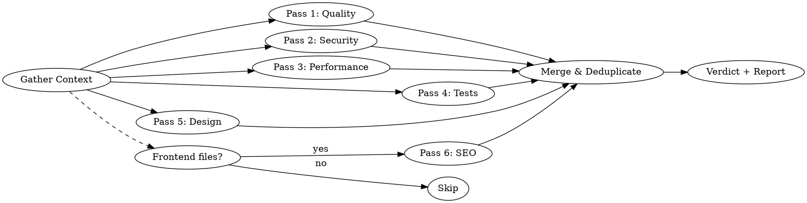

# Deep Code Review

## Overview

A comprehensive code review combining up to six expert perspectives — **code quality**, **security**, **performance**, **test quality**, **design fit**, and conditionally **SEO & AI discoverability** — into a single structured review. Each perspective runs as a parallel analysis pass, producing severity-rated findings with actionable fixes.

**Core principle:** Be harsh. Issues caught now cost 10x less than issues caught in production.

## When to Use

- Before creating a pull request
- After implementing a feature or bugfix
- When asked to review code, a diff, or a file
- When auditing unfamiliar or inherited code
- When onboarding to a codebase and assessing quality

**When NOT to use:**
- Trivial one-line changes (typo fixes, version bumps)
- Auto-generated code (migrations, lock files)

## The Review Passes

Run up to six passes in parallel using subagents. Passes 1–5 always run. Pass 6 (SEO & AI Discoverability) only runs when the diff contains frontend files — it is silently skipped otherwise. Each pass produces findings in the standard format below.



### Step 0: Gather Context

Before any analysis, build a mental model of the change:

1. **Identify target code:**
   - PR/branch: `git diff main...HEAD` (all commits, not just latest)
   - Specific files: read those files
   - Recent work: `git diff` (unstaged) + `git diff --cached` (staged)

2. **Read project conventions** — check CLAUDE.md, .editorconfig, linter configs, README for project-specific rules, patterns, and architecture decisions.

3. **Understand intent** — read PR description, commit messages, or linked issues. What problem is this solving? What's the expected behavior?

4. **Note context** — language, framework, how often this code runs, expected data scale, who the consumers of this code are.

### Pass 1: Code Quality (The Brutal Reviewer)

Review as a senior developer who would rather reject a PR than let a bug ship.

**Check for:**

| Category | Look For |
|----------|----------|
| **Bugs** | Logic errors, off-by-one, null/undefined handling, race conditions, incorrect comparisons, wrong operator precedence |
| **Error handling** | Swallowed exceptions, missing error paths, catch blocks that hide failures, unhandled promise rejections, silent fallbacks that mask real problems |
| **Edge cases** | Empty inputs, boundary values, concurrent access, unicode, timezone issues, integer overflow |
| **Maintainability** | Unclear naming, excessive complexity (cyclomatic > 10), duplication, god functions (> 50 lines), deep nesting (> 3 levels) |
| **Correctness** | Does the code actually do what the PR/commit message claims? Are there missing cases in switches/ifs? |
| **API contracts** | Are return types consistent? Can callers get unexpected nulls? Are errors propagated correctly? |
| **Concurrency** | Thread safety of shared state, lock ordering (deadlock risk), atomicity assumptions, safe publication of objects |

### Pass 2: Security (The Attacker's Mindset)

Audit as someone trying to exploit this code. Assume an attacker with full knowledge of the stack.

**Check for:**

| Category | Look For |
|----------|----------|
| **Injection** | SQL, NoSQL, command, LDAP, template, header injection. Any string concatenation into queries/commands |
| **Auth/AuthZ** | Session handling, privilege escalation, token expiration, missing permission checks, IDOR |
| **Data exposure** | Secrets in logs, verbose error messages leaking internals, API responses with excessive data, PII in URLs |
| **Input validation** | Missing sanitization, type coercion exploits, length limits, path traversal, SSRF via user-supplied URLs |
| **Cryptography** | Weak algorithms (MD5/SHA1 for security), hardcoded secrets, improper key handling, missing salt, predictable randomness |
| **Dependencies** | Known CVEs in imports, overly broad permissions, prototype pollution vectors |

For each finding, include:
- **Attack scenario**: How would someone exploit this? (1-2 sentences)
- **OWASP/CWE reference**: If applicable (e.g., CWE-89: SQL Injection)

### Pass 3: Performance (The Scalability Engineer)

Analyze as if this code will handle 100x its current load tomorrow.

**Check for:**

| Category | Look For |
|----------|----------|
| **Time complexity** | O(n^2) or worse in loops, unnecessary iterations, repeated lookups that should be cached |
| **Database** | N+1 queries, missing indexes (filter/join/order columns), over-fetching (SELECT *), large transactions holding locks |
| **Memory** | Large allocations in hot paths, unbounded collections, missing pagination, memory leaks (event listeners, closures, caches without eviction) |
| **I/O** | Blocking calls on async paths, sequential when parallelizable, missing timeouts on external calls, chatty APIs |
| **Quick wins** | Simple changes with outsized impact — early returns, short-circuit evaluation, batch operations, connection pooling |

For each finding, include:
- **Current behavior**: What happens now under load
- **Expected improvement**: Rough estimate (e.g., "O(n) to O(1) lookup", "eliminates N+1 for collections > 10")

### Pass 4: Test Quality (The QA Lead)

Tests are the most under-reviewed part of any PR. Review them as if they're the only documentation that will survive.

**Check for:**

| Category | Look For |
|----------|----------|
| **Coverage gaps** | New code paths without tests, untested error/edge cases, missing boundary value tests |
| **Test design** | Tests coupled to implementation details (brittle), unclear test names, no clear arrange/act/assert structure |
| **False confidence** | Tests that pass but don't actually verify behavior (e.g., no assertions, assertions on mocks instead of results, tautological tests) |
| **Missing scenarios** | Happy path only? What about: empty input, null, max-size, concurrent calls, network failure, permission denied? |
| **Test isolation** | Shared mutable state between tests, order-dependent tests, tests that hit real external services without mocking |
| **Regression value** | Would these tests catch the bug if someone broke this code next month? If not, what's missing? |

For each finding, include:
- **What's untested**: The specific scenario or code path
- **Suggested test**: Brief description or pseudocode of what to add

### Pass 5: Design & Architecture Fit (The Staff Engineer)

Zoom out. Does this change fit the system, or is it fighting it?

**Check for:**

| Category | Look For |
|----------|----------|
| **System fit** | Does this follow existing patterns in the codebase, or introduce a conflicting new one? (e.g., a new HTTP client when one already exists) |
| **Abstraction level** | Is this too abstract (premature generalization) or too concrete (hardcoded for one case when it'll need to flex)? |
| **Breaking changes** | Changed method signatures, removed fields, altered return types, database schema changes that affect existing consumers |
| **Coupling** | Does this create tight coupling between modules that should be independent? Hidden dependencies? |
| **Separation of concerns** | Business logic in controllers? DB queries in UI code? Side effects in pure functions? |
| **API design** | Are public interfaces intuitive? Would a new developer understand how to use this without reading the implementation? |

For each finding, include:
- **Impact scope**: Who/what is affected by this design issue?
- **Alternative**: Brief sketch of a better approach

## Finding Format

Every finding across all passes uses this structure:

```
### [SEVERITY] Category: Short description

**File:** `path/to/file.ext:line`
**Pass:** Quality | Security | Performance | Tests | Design
**Confidence:** Certain | High | Needs investigation

**Problem:** What's wrong, in 1-3 sentences.

**Fix:**
```lang
// suggested code change
```

[Pass-specific fields: attack scenario, OWASP ref, expected improvement, etc.]
```

## Confidence Levels

Not all findings carry equal certainty. Be honest about what you know.

| Level | Meaning | When to use |
|-------|---------|-------------|
| **Certain** | This is definitely a bug/vulnerability/issue | You can see the problem in the code |
| **High** | Very likely an issue, but depends on context | Requires knowing runtime behavior or config |
| **Needs investigation** | Suspicious pattern worth checking | Can't confirm without running code, checking DB schema, or asking the author |

## Severity Levels

| Level | Definition | Action |
|-------|-----------|--------|
| **CRITICAL** | Will cause data loss, security breach, or outage | Block merge. Fix immediately. |
| **HIGH** | Bug that will hit users, significant security/perf risk | Fix before merge. |
| **MEDIUM** | Code smell, minor risk, suboptimal pattern | Fix in this PR if quick, else track. |
| **LOW** | Style, naming, minor improvement | Optional. Note for awareness. |

## Output Structure

Present the final merged review in this order:

### 1. Verdict (first line)

A single line at the very top — instant signal, no reading required:

- **BLOCK** — has CRITICAL or multiple HIGH findings. Do not merge.
- **NEEDS CHANGES** — has HIGH findings that must be addressed first.
- **APPROVE WITH NOTES** — no blockers, but has MEDIUM findings worth addressing.
- **APPROVE** — clean. Ship it.

Format: `**Verdict: [STATUS]** — [one-sentence reason]`

### 2. Summary

One paragraph — overall assessment, finding counts by severity, what the change does well.

### 3. Critical & High findings

Grouped, with full detail and fixes. These are the blockers.

### 4. Medium findings

Grouped, briefer descriptions.

### 5. Low findings

Bullet list, one line each.

### 6. What's good

2-3 things the code does well (reinforces good patterns, acknowledges good work).

Deduplicate: if the same code triggers findings in multiple passes (e.g., string concatenation is both a bug and an injection risk), merge into one finding and tag all applicable passes.

## Execution

When reviewing code:

1. **Gather context** — read the code, project conventions, commit messages. Understand intent before judging implementation.
2. **Launch five parallel subagents** — one per pass, each with the relevant checklist above and the code to review.
3. **Merge results** — deduplicate, assign final severities and confidence levels, sort by severity.
4. **Present** — verdict first, then use the output structure above.

If the codebase is small (< 200 lines changed), run all passes yourself without subagents.

## Common Mistakes

| Mistake | Fix |
|---------|-----|
| Reviewing only the latest commit in a PR | Review ALL commits: `git diff main...HEAD` |
| Flagging style issues as HIGH | Style is LOW. Reserve HIGH for real bugs and risks. |
| Suggesting rewrites instead of targeted fixes | Suggest the minimal change that fixes the issue |
| Missing the forest for the trees | Start by understanding what the code is trying to do |
| Not considering the runtime context | An O(n^2) loop over 5 items is fine. Over 50k items, it's not. Ask about scale. |
| Skipping test review | Tests ARE production code. Review them with the same rigor. |
| Reporting uncertain findings as certain | Use confidence levels. "Needs investigation" is better than a false positive. |
| Ignoring project conventions | Read CLAUDE.md and linter configs FIRST. Don't flag things the project intentionally allows. |
