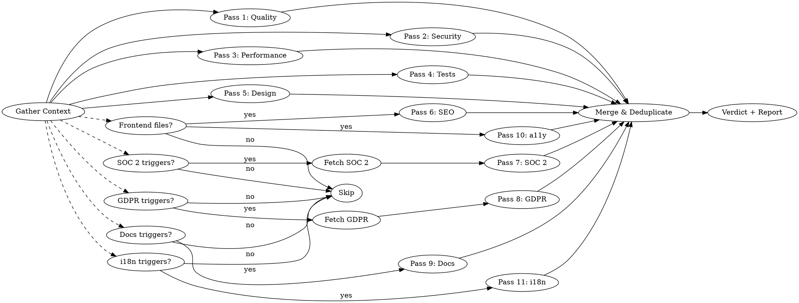

# Deep Code Review

## Overview

A comprehensive code review combining up to eleven expert perspectives — **code quality**, **security**, **performance**, **test quality**, **design fit**, and conditionally **SEO & AI discoverability**, **SOC 2 compliance**, **GDPR compliance**, **documentation & content**, **accessibility**, and **i18n & localization** — into a single structured review. Each perspective runs as a parallel analysis pass, producing severity-rated findings with actionable fixes.

**Core principle:** Be harsh. Issues caught now cost 10x less than issues caught in production.

## When to Use

- Before creating a pull request
- After implementing a feature or bugfix
- When asked to review code, a diff, or a file
- When auditing unfamiliar or inherited code
- When onboarding to a codebase and assessing quality

**When NOT to use:**
- Trivial one-line changes (typo fixes, version bumps)
- Auto-generated code (migrations, lock files)

## The Review Passes

Run up to eleven passes in parallel using subagents. Passes 1–5 always run. Pass 6 (SEO), Pass 7 (SOC 2), Pass 8 (GDPR), Pass 9 (Documentation), Pass 10 (Accessibility), and Pass 11 (i18n) only run when their trigger conditions are met. Each pass produces findings in the standard format below.



### Step 0: Gather Context

Before any analysis, build a mental model of the change:

1. **Identify target code:**
   - PR/branch: `git diff main...HEAD` (all commits, not just latest)
   - Specific files: read those files
   - Recent work: `git diff` (unstaged) + `git diff --cached` (staged)

2. **Read project conventions** — check CLAUDE.md, .editorconfig, linter configs, README for project-specific rules, patterns, and architecture decisions.

3. **Understand intent** — read PR description, commit messages, or linked issues. What problem is this solving? What's the expected behavior?

4. **Note context** — language, framework, how often this code runs, expected data scale, who the consumers of this code are.

5. **Launch compliance fetch (if triggered)** — after identifying target code in sub-step 1, evaluate the Pass 7 and Pass 8 trigger conditions against the diff. For each triggered pass, launch its fetch agent in parallel with sub-steps 2-4 using `WebSearch` and `WebFetch` tools. Source fetches run in parallel with a total wall-clock timeout of 15 seconds. Collect results here before launching passes. See Pass 7 and Pass 8 sections for fetch agent details. If fetch fails, passes proceed using built-in checklists.

### Pass 1: Code Quality (The Brutal Reviewer)

Review as a senior developer who would rather reject a PR than let a bug ship.

**Check for:**

| Category | Look For |
|----------|----------|
| **Bugs** | Logic errors, off-by-one, null/undefined handling, race conditions, incorrect comparisons, wrong operator precedence |
| **Error handling** | Swallowed exceptions, missing error paths, catch blocks that hide failures, unhandled promise rejections, silent fallbacks that mask real problems |
| **Edge cases** | Empty inputs, boundary values, concurrent access, unicode, timezone issues, integer overflow |
| **Maintainability** | Unclear naming, excessive complexity (cyclomatic > 10), duplication, god functions (> 50 lines), deep nesting (> 3 levels) |
| **Correctness** | Does the code actually do what the PR/commit message claims? Are there missing cases in switches/ifs? |
| **API contracts** | Are return types consistent? Can callers get unexpected nulls? Are errors propagated correctly? |
| **Concurrency** | Thread safety of shared state, lock ordering (deadlock risk), atomicity assumptions, safe publication of objects |

### Pass 2: Security (The Attacker's Mindset)

Audit as someone trying to exploit this code. Assume an attacker with full knowledge of the stack.

**Check for:**

| Category | Look For |
|----------|----------|
| **Injection** | SQL, NoSQL, command, LDAP, template, header injection. Any string concatenation into queries/commands |
| **Auth/AuthZ** | Session handling, privilege escalation, token expiration, missing permission checks, IDOR |
| **Data exposure** | Secrets in logs, verbose error messages leaking internals, API responses with excessive data, PII in URLs |
| **Input validation** | Missing sanitization, type coercion exploits, length limits, path traversal, SSRF via user-supplied URLs |
| **Cryptography** | Weak algorithms (MD5/SHA1 for security), hardcoded secrets, improper key handling, missing salt, predictable randomness |
| **Dependencies** | Known CVEs in imports, overly broad permissions, prototype pollution vectors |

For each finding, include:
- **Attack scenario**: How would someone exploit this? (1-2 sentences)
- **OWASP/CWE reference**: If applicable (e.g., CWE-89: SQL Injection)

### Pass 3: Performance (The Scalability Engineer)

Analyze as if this code will handle 100x its current load tomorrow.

**Check for:**

| Category | Look For |
|----------|----------|
| **Time complexity** | O(n^2) or worse in loops, unnecessary iterations, repeated lookups that should be cached |
| **Database** | N+1 queries, missing indexes (filter/join/order columns), over-fetching (SELECT *), large transactions holding locks |
| **Memory** | Large allocations in hot paths, unbounded collections, missing pagination, memory leaks (event listeners, closures, caches without eviction) |
| **I/O** | Blocking calls on async paths, sequential when parallelizable, missing timeouts on external calls, chatty APIs |
| **Quick wins** | Simple changes with outsized impact — early returns, short-circuit evaluation, batch operations, connection pooling |

For each finding, include:
- **Current behavior**: What happens now under load
- **Expected improvement**: Rough estimate (e.g., "O(n) to O(1) lookup", "eliminates N+1 for collections > 10")

### Pass 4: Test Quality (The QA Lead)

Tests are the most under-reviewed part of any PR. Review them as if they're the only documentation that will survive.

**Check for:**

| Category | Look For |
|----------|----------|
| **Coverage gaps** | New code paths without tests, untested error/edge cases, missing boundary value tests |
| **Test design** | Tests coupled to implementation details (brittle), unclear test names, no clear arrange/act/assert structure |
| **False confidence** | Tests that pass but don't actually verify behavior (e.g., no assertions, assertions on mocks instead of results, tautological tests) |
| **Missing scenarios** | Happy path only? What about: empty input, null, max-size, concurrent calls, network failure, permission denied? |
| **Test isolation** | Shared mutable state between tests, order-dependent tests, tests that hit real external services without mocking |
| **Regression value** | Would these tests catch the bug if someone broke this code next month? If not, what's missing? |

For each finding, include:
- **What's untested**: The specific scenario or code path
- **Suggested test**: Brief description or pseudocode of what to add

### Pass 5: Design & Architecture Fit (The Staff Engineer)

Zoom out. Does this change fit the system, or is it fighting it?

**Check for:**

| Category | Look For |
|----------|----------|
| **System fit** | Does this follow existing patterns in the codebase, or introduce a conflicting new one? (e.g., a new HTTP client when one already exists) |
| **Abstraction level** | Is this too abstract (premature generalization) or too concrete (hardcoded for one case when it'll need to flex)? |
| **Breaking changes** | Changed method signatures, removed fields, altered return types, database schema changes that affect existing consumers |
| **Coupling** | Does this create tight coupling between modules that should be independent? Hidden dependencies? |
| **Separation of concerns** | Business logic in controllers? DB queries in UI code? Side effects in pure functions? |
| **API design** | Are public interfaces intuitive? Would a new developer understand how to use this without reading the implementation? |

For each finding, include:
- **Impact scope**: Who/what is affected by this design issue?
- **Alternative**: Brief sketch of a better approach

### Pass 6: SEO & AI Discoverability (The Search Strategist) — Conditional

**This pass only runs when the diff contains frontend files** (`.html`, `.htm`, `.jsx`, `.tsx`, `.vue`, `.svelte`, `.astro`, `.njk`, `.ejs`, `.hbs`, `.php`, `.erb`, `.mdx`, `.md`) or SEO-specific files (`robots.txt`, `robots.ts`, `robots.js`, `sitemap.xml`, `sitemap.ts`, `sitemap.js`, `llms.txt`, `manifest.json`). If none are present, skip this pass silently.

Review as a search strategist optimizing for both traditional crawlers and AI systems (ChatGPT, Perplexity, Google AI Overviews).

**Scope:** Examine only the matching frontend files from the diff, reading surrounding layout/route files for context as needed. Prefer findings related to lines actually changed. Flag pre-existing issues only at CRITICAL or HIGH severity. Skip files clearly identifiable as email templates (e.g., in `email/` or `mailer/` directories). Files in route directories are never excluded.

**Page-level vs. leaf component classification:**

A component is **page-level** if any of: it lives in a route directory (`pages/`, `app/`, `routes/`, `src/routes/`, `src/pages/`); it is named `page.*`, `layout.*`, `_document.*`, `_app.*`, or `index.*` in a route directory; it renders `<html>`, `<head>`, or `<body>` tags; it exports `metadata`, `generateMetadata`, `meta`, or calls `useHead`/`useSeoMeta`. Everything else is **leaf-level** — only check `alt` on images, link text quality, and heading hierarchy within the component. When ambiguous, default to leaf-level.

**Priority checks** (always evaluate):

| Category | Look For |
|----------|----------|
| **Metadata** | Missing/duplicate `<title>`, `<meta description>`, canonical URLs, `<meta robots>`, viewport, charset, lang, OG tags (`og:title`, `og:description`, `og:image`), Twitter cards. Check the framework's idiomatic API before flagging raw `<head>` elements |
| **Structured data** | Missing/invalid schema.org (JSON-LD preferred), incorrect types (including typos), missing required properties, `datePublished`/`dateModified`, `Person` schema when applicable. When populated from CMS/external sources, flag template issues (e.g., missing null fallbacks) but not missing fields that may come from runtime data |
| **Semantic HTML & links** | Heading hierarchy skips, missing landmark roles (page-level only). Generic link text (`click here`, `read more`, empty `<a>`), `href="#"` / `javascript:void(0)` |
| **Crawlability** | JS-only content without SSR/SSG, client-side-only routing (hash-based `/#/page`), `<noscript>` fallbacks (only when SSR/SSG absent), conflicting signals (canonical vs. `noindex`), `robots.txt` rules blocking AI crawlers |

**Secondary checks** (evaluate if context permits):

| Category | Look For |
|----------|----------|
| **AI discoverability** | Missing `llms.txt`/`llms-full.txt`, missing RSS/Atom feeds (content-heavy/docs sites only) |
| **Accessibility & performance** | Missing `alt` attribute (do not flag `alt=""`), images/iframes without `width`/`height` (CLS), iframes missing `title`, hero images with `loading="lazy"` (anti-pattern — identify by component name containing "hero"/"banner"/"cover" or first image in a page-level component; use `fetchpriority="high"` instead), render-blocking external `<link>`/`<script>` without `async`/`defer` (do not flag inline `<style>`/`<script>`) |
| **Internationalization** | Missing `hreflang` (only when i18n evidence exists) |

**Security cross-references** — when a finding has security implications, add a `Cross-ref: Pass 2` field:

| Check | Security Risk |
|-------|--------------|
| Canonical URL pointing to external domain | Canonical hijacking |
| `og:image` from user input | SSRF, stored XSS via SVG |
| JSON-LD fields from unsanitized input | Script injection via `</script>` breakout (CWE-79) |
| Structured data exposing internal IDs/PII | Information disclosure |
| `robots.txt` `Disallow` revealing sensitive paths | Path enumeration |
| `llms.txt` referencing internal endpoints | Architecture disclosure |

These checks assess what is visible in the frontend template code. When data flow from backend sources cannot be determined from the diff, use "Needs investigation" confidence.

**Key rules:**
1. Check the layout/route chain before flagging missing meta tags. Metadata may be inherited from parent layouts (Next.js App Router `generateMetadata`, Remix v2+ `meta`, Nuxt `useHead` in layouts).
2. Use "Needs investigation" confidence when a check cannot be fully verified from the diff: SSR/SSG status without framework signals, structured data vs. Google's requirements, broken links/orphan pages, `llms.txt` relevance, image dimensions in Tailwind/CSS-in-JS, ambiguous locale paths, content extractability. For hero/LCP images: use higher confidence when the heuristic matches; "Needs investigation" otherwise.
3. Err on fewer, higher-confidence findings. Zero findings is acceptable for well-maintained codebases.

**Severity calibration for SEO findings:**

| Severity | SEO Example |
|----------|-------------|
| **CRITICAL** | `noindex` on a page meant to be indexed; JSON-LD script injection |
| **HIGH** | Missing `<title>` (after checking inheritance); all images missing `alt`; JS-only content with no SSR; hash-based routing; AI crawlers blocked in `robots.txt` unintentionally |
| **MEDIUM** | Missing OG tags; heading hierarchy skips; missing canonical; CLS from missing dimensions; generic link text |
| **LOW** | Missing `llms.txt`; minor structured data gaps; missing iframe `title`; `href="#"` with onClick handler |

For each finding, include:
- **SEO impact**: How this affects search ranking or AI discoverability (1-2 sentences)
- **Affected signal**: Human-readable context — e.g., "Core Web Vitals: CLS", "Google Search: structured data"
- **Cross-ref** (optional): Which other pass this finding overlaps with

**Out of scope:** Framework config files, micro-frontend fragments (shell owns `<head>`), CSS-only concerns (except inline `@font-face`), runtime behavior, HTTP headers, CDN/caching, redirect rules, mobile UX beyond viewport.

### Pass 7: SOC 2 Compliance (The Auditor) — Conditional

**This pass runs when the diff contains code touching** authentication, authorization, access control, RBAC/ABAC, logging, audit trails, observability, encryption, key management, certificate handling, monitoring, alerting, anomaly detection, backup, recovery, failover, disaster recovery, change management, deployment pipelines, infrastructure configuration (Terraform, CloudFormation, Ansible, Kubernetes, Dockerfiles), CI/CD pipeline definitions (`.github/workflows`, `Jenkinsfile`, `.gitlab-ci.yml`), database schema changes, migrations, API definitions, OpenAPI specs, dependency management files (`package.json`, `requirements.txt`, `go.mod`, etc.), environment/secrets configuration, health checks, circuit breakers, retry/timeout logic, network/firewall configuration, security groups, WAF rules, vendor/third-party service integrations, user/role provisioning, lifecycle management, incident response, escalation, on-call routing, or error handling in data processing. If none are present, skip this pass silently.

**Project-level opt-in:** If the project contains a `.compliance` config, SOC 2 annotations in `CLAUDE.md`, or files in directories named `compliance/`, `soc2/`, `audit/`, `security/` — run this pass if the diff touches any code file.

**When uncertain:** Err on the side of running the pass. A pass that produces zero findings is preferable to a skipped pass that would have found a CRITICAL issue.

**Compliance research fetch:** Before this pass runs, a fetch agent searches for current SOC 2 guidance using `WebSearch`/`WebFetch` (sources: AICPA freely available TSC guidance, SOC 2 Type II summaries, recent AICPA updates, ISACA guidance, NIST SP 800-53 TSC mapping, cloud-specific SOC 2 guides, CSA STAR registry). Fetch output is capped at 3000 tokens. If fetch fails or times out (15-second wall-clock limit), the pass proceeds using the built-in checklist below.

**Built-in checklist last verified: 2026-03-19.**

Review as a SOC 2 auditor preparing for a Type II audit. Most code review findings will be design deficiencies (Type I) — note this when relevant.

**Scope:** Focus findings on code changed in the diff. Flag pre-existing compliance gaps only when they are CRITICAL or when the diff makes them actively worse (e.g., adding a new endpoint to a service with no audit logging).

**Check for:**

| Category | TSC Reference | Look For |
|----------|--------------|----------|
| **Logical & Physical Access** | CC6 | Missing auth checks (CC6.1), missing user registration/authorization (CC6.2), missing access removal/deprovisioning (CC6.3), overly broad permissions, hardcoded roles, shared accounts, missing MFA enforcement, missing session expiration, no account lockout, excessive token lifetimes, system boundary security gaps (CC6.6), unencrypted data in transit (CC6.7), missing input validation for malware prevention (CC6.8) |
| **Control Activities** | CC5 (also CC6.1) | Missing segregation of duties (same service creates and approves), no dual-control for sensitive operations, missing approval workflows in code |
| **System Operations** | CC7 | Missing detection mechanisms (CC7.1), missing monitoring for anomalies (CC7.2), no incident evaluation logic (CC7.3), missing incident response procedures (CC7.4), no recovery procedures (CC7.5), audit logs missing timestamps/user context/action details, mutable or deletable logs |
| **Change Management** | CC8 | Missing change tracking, deployments without approval gates, no rollback capability, missing version control of configs, CI/CD without review gates |
| **Vendor & Business Risk** | CC9 | Unassessed third-party service integrations (CC9.2), missing vendor risk evaluation, no sub-processor controls, business continuity gaps (CC9.1) |
| **Monitoring Activities** | CC4 | Missing ongoing monitoring of controls (CC4.1), no evaluation/communication of deficiencies (CC4.2) |
| **Risk Assessment** | CC3 | Missing risk identification for new features, no threat modeling signals, unassessed third-party integrations |
| **Availability** | A1 | Missing capacity planning/scaling (A1.1), missing backup/recovery mechanisms (A1.2), untested recovery procedures/failover (A1.3), no circuit breakers, missing timeout configurations, single points of failure |
| **Confidentiality** | C1 | Secrets in code/logs/configs, PII in URLs or query strings, missing data classification, overly verbose error messages exposing internals (C1.1), no disposal procedures for confidential data (C1.2) |
| **Processing Integrity** | PI1 | Missing input validation for completeness/accuracy (PI1.2), data transformation errors (PI1.3), missing output validation (PI1.4), no processing completeness checks, data corruption without detection (PI1.5) |

**Scope note:** This pass covers the Security (CC3-CC9), Availability (A1), Confidentiality (C1), and Processing Integrity (PI1) trust services categories. CC1 (Control Environment) and CC2 (Communication and Information) are organizational controls not observable in code diffs and are excluded. Privacy (P1) is delegated to Pass 8 (GDPR) — findings relevant to both are cross-referenced.

**Severity calibration for SOC 2 findings:**

| Severity | SOC 2 Example |
|----------|---------------|
| **CRITICAL** | Disabled auth on an endpoint; logging plaintext passwords; hardcoded encryption keys in source; audit logs modifiable by application code |
| **HIGH** | Missing access control on admin endpoint; no audit logging for data modification; encryption at rest disabled; secrets in env vars without vault (context-dependent — acceptable in 12-factor apps with runtime injection from a secrets manager) |
| **MEDIUM** | Overly broad IAM permissions; missing rate limiting on auth endpoints; log entries missing correlation IDs; backup not tested |
| **LOW** | Inconsistent log format; missing comments on security-relevant config; alert threshold could be tighter |

For each finding, include:
- **TSC Reference**: Specific criterion (e.g., CC6.1, CC7.2, A1.2)
- **Control gap**: What specific control is missing or deficient
- **Audit risk**: How an auditor would classify this — design deficiency vs. operating effectiveness concern
- **Evidence recommendation**: What evidence should exist to demonstrate the control
- **Cross-ref** (optional): Other pass this overlaps with
- **Based on**: Source and date accessed (from fetch agent, or "built-in checklist")

### Pass 8: GDPR Compliance (The Data Protection Officer) — Conditional

**This pass runs when the diff contains code touching** user data, personal information, PII fields, consent mechanisms, cookie banners, consent records, analytics, tracking, telemetry, third-party tracking scripts, data storage with user data, email collection, notification systems, marketing automation, user accounts, profiles, registration, data exports, data portability endpoints, deletion endpoints, data erasure, soft-delete logic, privacy configuration, privacy policies, data retention, TTL logic, scheduled cleanup/archival, third-party SDK/service integrations (analytics, CRM, payment, etc.), forms or input fields collecting user data, profiling, recommendation engines, scoring, ML/model training on user data, logging/telemetry that may contain PII (IP addresses, user agents, user IDs), geolocation, IP-based features, age gating, date-of-birth fields, data breach detection/notification code, cross-border data transfer logic, storage region selection, or data processing agreements/sub-processor configuration. If none are present, skip this pass silently.

**Project-level opt-in:** If the project contains privacy policy files, DPA templates, GDPR annotations in `CLAUDE.md`, or files in directories named `gdpr/`, `privacy/`, `compliance/` — run this pass if the diff touches any code file.

**When uncertain:** Err on the side of running the pass.

**Compliance research fetch:** Before this pass runs, a fetch agent searches for current GDPR guidance using `WebSearch`/`WebFetch` (sources: EUR-Lex Regulation 2016/679, EDPB guidelines, Article 29 WP opinions, ICO guidance, CNIL guidance, BfDI/Hamburg DPA/AEPD/Garante/AP guidance, ePrivacy Directive 2002/58/EC, CJEU case law including Schrems II and Planet49, recent enforcement actions). Fetch output is capped at 3000 tokens. If fetch fails or times out (15-second wall-clock limit), the pass proceeds using the built-in checklist below.

**Built-in checklist last verified: 2026-03-19.**

Review as a data protection officer preparing for a supervisory authority audit.

**Scope:** Focus findings on code changed in the diff. Flag pre-existing compliance gaps only when they are CRITICAL or when the diff makes them actively worse.

**Check for:**

| Category | GDPR Reference | Fine Tier | Look For |
|----------|---------------|-----------|----------|
| **Lawful Basis** | Art. 6 | Tier 2 (4%) | Processing personal data without documented legal basis, missing consent collection before processing, consent not freely given/specific/informed/unambiguous, pre-ticked consent boxes |
| **Data Minimization** | Art. 5(1)(c) | Tier 2 (4%) | Collecting more data than necessary, storing fields with no clear purpose, `SELECT *` on user tables, logging full request bodies containing PII |
| **Purpose Limitation** | Art. 5(1)(b) | Tier 2 (4%) | Data collected for one purpose used for another without consent, analytics data repurposed for marketing, shared user data across services without basis |
| **Accuracy** | Art. 5(1)(d) | Tier 2 (4%) | No mechanism to keep personal data up to date, stale PII without review/correction triggers, no link between rectification endpoint and downstream data stores |
| **Storage Limitation** | Art. 5(1)(e) | Tier 2 (4%) | No TTL or retention policy on personal data, missing automated deletion/anonymization, soft-deletes that retain full PII indefinitely |
| **Integrity & Confidentiality** | Art. 5(1)(f) | Tier 2 (4%) | PII not encrypted at rest or in transit, missing access controls on personal data, no pseudonymization where feasible |
| **Accountability** | Art. 5(2) | Tier 2 (4%) | Missing audit trails for data processing decisions, no logging of PII operations, no evidence of compliance measures |
| **Consent Management** | Art. 7 | Tier 2 (4%) | No consent record stored, no way to withdraw consent, consent not granular (all-or-nothing), missing consent versioning, cookie banners without reject option |
| **Special Category Data** | Art. 9 | Tier 2 (4%) | Processing health/biometric/genetic/racial/political data without explicit consent or Art. 9(2) exception, no technical safeguards distinguishing special category data from regular PII |
| **Transparency** | Art. 13-14 | Tier 2 (4%) | Data collection points without privacy information, missing transparency notices for direct (Art. 13) and indirect (Art. 14) collection |
| **Right of Access** | Art. 15 | Tier 2 (4%) | No endpoint for data subjects to obtain a copy of their data, missing query capabilities for user data export |
| **Right to Rectification** | Art. 16 | Tier 2 (4%) | No mechanism to correct inaccurate personal data, user profiles without edit capability |
| **Right to Erasure** | Art. 17 | Tier 2 (4%) | No deletion endpoint, incomplete deletion (data left in backups/caches/logs/analytics), cascading deletes not covering all stores, no mechanism to propagate deletion to processors |
| **Right to Object** | Art. 21 | Tier 2 (4%) | No mechanism to opt out of direct marketing, missing objection handling for legitimate interest processing, no profiling opt-out |
| **Right to Portability** | Art. 20 | Tier 2 (4%) | No data export endpoint, export missing key data categories, non-machine-readable export format |
| **Automated Decision-Making** | Art. 22 | Tier 2 (4%) | ML inference, scoring, or automated eligibility without human review option, no explanation capability for automated decisions, profiling with legal/significant effects |
| **Data Protection by Design** | Art. 25 | Tier 1 (2%) | PII not encrypted at rest, no pseudonymization where feasible, missing access controls on personal data, no data classification in schema |
| **Processor Obligations** | Art. 28 | Tier 1 (2%) | Third-party data processing integrations without contractual safeguards, missing DPA requirements at integration points |
| **Security of Processing** | Art. 32 | Tier 1 (2%) | Missing appropriate technical measures — pseudonymization, encryption, system resilience, restoration capability, regular security testing |
| **Breach Notification** | Art. 33-34 | Tier 1 (2%) | No logging of data access for breach investigation, missing audit trail on PII operations, no mechanism to detect unauthorized access, no notification pipeline |
| **DPIA Signals** | Art. 35 | Tier 1 (2%) | Large-scale profiling, automated decision-making, systematic monitoring, large-scale processing of special category data — flag as needing DPIA if not documented |
| **Children's Data** | Art. 8 | Tier 1 (2%) | No age verification when service may be used by minors, missing parental consent mechanism |
| **Cross-border Transfers** | Art. 44-49 | Tier 2 (4%) | Personal data sent to third-country services without adequacy decision or SCCs, CDN/analytics providers in non-adequate countries without safeguards |
| **Cookie & eComms Consent** | ePrivacy Dir. Art. 5(3) | National law | Non-essential cookies set before consent, analytics firing before consent granted, no mechanism to reject non-essential cookies, missing cookie categorization |
| **Unsolicited Communications** | ePrivacy Dir. Art. 13 | National law | Email marketing without opt-in consent (opt-in required in most EU member states), no unsubscribe mechanism, marketing to non-customers without prior consent |

**Fine tier reference:**
- **Tier 1 (Art. 83(4))**: Up to EUR 10 million / 2% of global annual turnover — controller/processor obligations (Art. 8, 11, 25-39, 42-43)
- **Tier 2 (Art. 83(5))**: Up to EUR 20 million / 4% of global annual turnover — basic principles (Art. 5-7, 9), data subject rights (Art. 12-22), transfers (Art. 44-49)

**Cross-references:**

| Check | Cross-ref |
|-------|-----------|
| PII in logs or error messages | Pass 2: Data exposure |
| Missing encryption at rest | Pass 2: Cryptography, Pass 7: C1 |
| No access controls on personal data | Pass 2: Auth/AuthZ, Pass 7: CC6 |
| Missing audit logging on PII operations | Pass 7: CC7 |
| Missing encryption in transit for PII | Pass 2: Cryptography, Pass 7: CC6.7 |
| Unsanitized user input stored as PII | Pass 2: Injection |
| Cookie banner implementation issues | Pass 6: SEO (implementation), Pass 8: GDPR (compliance) |

**Severity calibration for GDPR findings:**

| Severity | GDPR Example |
|----------|--------------|
| **CRITICAL** | Processing PII without any lawful basis check; no mechanism for data deletion; transmitting PII over unencrypted channel; collecting children's data without age verification |
| **HIGH** | Consent checkbox pre-ticked; analytics firing before consent granted; PII in application logs without retention policy; missing data export endpoint for subject access requests |
| **MEDIUM** | Privacy policy link missing from data collection form; cookie banner not blocking non-essential cookies until consent; missing data portability export format |
| **LOW** | Data retention period not documented in code comments; consent record lacks granularity; privacy impact assessment suggested but not blocking |

For each finding, include:
- **GDPR Article**: Specific article reference (e.g., Art. 17(1), Art. 25(2))
- **Regulatory risk**: `[Tier 1: up to 10M/2% | Tier 2: up to 20M/4%] — [Low | Medium | High] likelihood based on enforcement precedent`
- **Cross-ref** (optional): Other pass this overlaps with
- **Based on**: Source and date accessed (from fetch agent, or "built-in checklist")

### Pass 9: Documentation & Content Verification (The Technical Writer) — Conditional

**This pass runs when the diff contains or the project has** markdown files (`.md`, `.mdx`), documentation directories (`docs/`, `wiki/`, `guides/`), user-facing content pages (terms, privacy policy, pricing, landing pages, about, FAQ), runbooks/playbooks (`runbook/`, `playbook/`, `operations/`), API documentation (OpenAPI specs, Swagger, `.apidoc`), changelog/release notes, or README files. If none are present, skip this pass silently.

Review as a technical writer who verifies that documentation matches reality.

**Scope:** Focus on documentation affected by or related to the diff. Don't audit the entire docs tree — check docs that reference code being changed, and code that is referenced by docs in the diff. Search docs for references to changed symbols (function names, endpoint paths, config keys, CLI commands) within documentation directories — one hop from the diff only. Cap non-diff file reads at 10 files. Flag pre-existing staleness only at CRITICAL or HIGH severity.

**Two-direction mismatch detection** — the pass does NOT assume code is the source of truth:

| Mismatch Type | Example | Action |
|--------------|---------|--------|
| **Page wrong, code right** | Page says "unlimited storage" but code enforces 10GB | Flag to fix page content |
| **Code wrong, page right** | Page says "10GB free tier" but code has no enforcement | Flag to fix code |
| **Unclear direction** | Feature listed on landing page, code exists but is behind a flag | Emit as finding with Confidence: Needs investigation, do NOT block |

**Exception for legal content:** For privacy policies, terms of service, and DPAs, the published legal document is presumed authoritative. Flag code mismatches as "Code wrong, page right" unless the document itself is clearly stale.

**Check for:**

| Category | Look For |
|----------|----------|
| **Feature claims vs code** | Landing page/marketing claims that don't match implemented functionality, features listed that don't exist or are disabled, capability descriptions that overstate what the code does |
| **Pricing/limits vs enforcement** | Pricing page limits not enforced in code, free tier claims without corresponding checks, quota descriptions that don't match config values |
| **Legal content vs implementation** | Terms of service promises not backed by code (data deletion timelines, data handling claims), privacy policy statements contradicted by actual data flows |
| **API docs vs implementation** | Endpoints documented but not implemented (or vice versa), request/response schemas that don't match actual types, documented error codes not returned by the code |
| **Runbook accuracy** | Runbook procedures referencing renamed/removed scripts, incorrect CLI commands, outdated configuration paths, missing steps for new dependencies |
| **Environment/config docs** | README or setup guide listing env vars that don't match what the code reads (added, removed, renamed vars), default values documented incorrectly, required vs optional mismatch |
| **Dependency/version docs** | Installation guide specifying versions that don't match manifests, setup steps referencing removed dependencies, prerequisite version ranges that are stale |
| **Architecture diagram drift** | Diagrams (mermaid, drawio, embedded markdown) referencing renamed/removed services or modules, data flow arrows that no longer match actual integrations |
| **CLI reference drift** | CLI help text or docs referencing flags/subcommands that have been added, removed, or renamed in code |
| **Staleness signals** | Docs referencing removed features, deprecated APIs still documented as current, version numbers that don't match, screenshots/examples using old UI |
| **Internal consistency** | README contradicting CONTRIBUTING.md, getting-started guide inconsistent with actual setup steps, conflicting instructions across docs |

**Key rules:**
1. When legal or user-facing content is referenced by URL only (not present in the repo), flag it as "Needs investigation — external content not verifiable from diff" rather than silently skipping.
2. When the diff changes code behavior that a legal document depends on (e.g., data retention logic), flag the legal document for manual review even if the doc itself wasn't changed.

**Out of scope:** Auto-generated documentation (Swagger UI, TypeDoc output, JSDoc HTML) where the source of truth is code annotations — flag the annotations, not the generated output. Documentation in external systems (Confluence, Notion, Google Docs) unless referenced by URL in the repo.

**Severity calibration for documentation findings:**

| Severity | Example |
|----------|---------|
| **CRITICAL** | Terms of service promise contradicted by code (legal exposure); pricing page claims feature that doesn't exist |
| **HIGH** | Runbook procedure will fail (wrong commands/paths); API docs show endpoints that return different schemas; env vars listed in README don't match code |
| **MEDIUM** | README setup steps missing a new dependency; changelog doesn't mention a breaking change; architecture diagram shows removed service |
| **LOW** | Minor version mismatch in docs; formatting inconsistencies; outdated screenshot |

For each finding, include:
- **Mismatch type**: Page wrong / Code wrong / Unclear — needs human
- **Content source**: Which document/page and which code disagree
- **Suggested direction**: Which side to fix (or "needs human decision")
- **Cross-ref** (optional): Other pass this overlaps with (e.g., Pass 8 for privacy policy vs GDPR)

### Pass 10: Accessibility (The Auditor) — Conditional

**This pass runs when the diff contains frontend template/component files:** `.html`, `.htm`, `.jsx`, `.tsx`, `.vue`, `.svelte`, `.astro`, `.njk`, `.ejs`, `.hbs`, `.php`, `.erb`. Does not trigger on content-only formats (`.md`, `.mdx`) or SEO-specific files (`robots.txt`, `sitemap.xml`, `llms.txt`, `manifest.json`). Silently skipped otherwise. Launched alongside Pass 6 when frontend files are present.

Review as an accessibility auditor conducting a WCAG 2.2 AA compliance assessment.

**Scope:** Examine only frontend files in the diff. Prefer findings related to lines actually changed. Flag pre-existing issues only at CRITICAL or HIGH severity. Same scope pattern as Pass 6 (SEO).

**Check for (WCAG 2.2 AA):**

| Category | WCAG Reference | Level | Look For |
|----------|---------------|-------|----------|
| **Text alternatives** | 1.1.1 | A | Missing `alt` on informational images (don't flag `alt=""`), missing text alternatives for icons/SVGs used as buttons, `<canvas>` without fallback |
| **Video/audio** | 1.2.1-1.2.5 | A/AA | Missing captions on video, no audio descriptions, no transcript for audio-only content |
| **Adaptable structure** | 1.3.1-1.3.5 | A/AA | Form inputs without labels (`<label>` or `aria-label`/`aria-labelledby`), using visual-only cues for meaning (color alone), missing landmark regions, tables without headers, incorrect `role` usage |
| **Distinguishable** | 1.4.1-1.4.5, 1.4.10-1.4.13 | A/AA | Color as sole indicator, text contrast below 4.5:1 (normal) or 3:1 (large), non-text contrast below 3:1 on UI components and graphical objects (1.4.11), text in images, no reflow support, content lost at 200% zoom |
| **Keyboard** | 2.1.1-2.1.4 | A/AA | Click handlers without keyboard equivalent, custom components not keyboard-navigable, keyboard traps (focus can't escape), missing `tabindex` management, non-interactive elements with `onClick` but no `role`/`tabIndex` |
| **Timing** | 2.2.1-2.2.2 | A | Auto-advancing content without pause/stop, session timeouts without warning/extension |
| **Seizures** | 2.3.1 | A | Flashing content > 3 times per second |
| **Navigation** | 2.4.1-2.4.11 | A/AA | Missing skip navigation link, unclear page titles, focus order doesn't match visual order, missing focus indicators (`:focus-visible`), heading hierarchy skips, focus obscured by sticky headers/overlays (2.4.11) |
| **Input modalities** | 2.5.1-2.5.8 | A/AA | Gestures without single-pointer alternative, no way to undo accidental activation, visible labels don't match accessible names, drag-and-drop without single-pointer alternative (2.5.7), interactive targets smaller than 24x24 CSS px (2.5.8) |
| **Readable** | 3.1.1-3.1.2 | A/AA | Missing `lang` attribute on `<html>`, language changes not marked with `lang` on containing element |
| **Predictable** | 3.2.1-3.2.6 | A/AA | Focus change triggers unexpected navigation, inconsistent navigation patterns across pages, help mechanisms (contact, chat, FAQ) not in consistent location across pages (3.2.6) |
| **Input assistance** | 3.3.1-3.3.8 | A/AA | Form errors not described in text, missing error suggestions, no confirmation for legal/financial submissions, requiring re-entry of previously provided information in multi-step forms (3.3.7), cognitive function tests in auth (CAPTCHA, puzzles) without accessible alternative (3.3.8) |
| **Compatible** | 4.1.2-4.1.3 | A/AA | Custom components missing ARIA name/role/state, status messages not using `role="status"` or `aria-live` |

**Easy AAA wins** (flagged as LOW severity):

| Category | WCAG Reference | Look For |
|----------|---------------|----------|
| **Enhanced contrast** | 1.4.6 (AAA) | Text contrast below 7:1 when a simple CSS change would fix it |
| **Link purpose** | 2.4.9 (AAA) | Generic link text ("click here", "read more") — already caught by Pass 6, cross-ref |
| **Section headings** | 2.4.10 (AAA) | Content sections without headings when adding one is trivial |

**Cross-references:**

| Check | Cross-ref |
|-------|-----------|
| Missing `alt` on images | Pass 6: SEO |
| Heading hierarchy skips | Pass 6: SEO |
| Generic link text | Pass 6: SEO |
| Missing `lang` attribute | Pass 6: SEO |
| Missing landmark roles | Pass 6: SEO (page-level only) |
| Keyboard traps in auth flows | Pass 2: Security |
| Missing labels on consent forms | Pass 8: GDPR |

**Key rules:**
1. Don't flag `alt=""` — empty alt is correct for decorative images.
2. Don't flag ARIA attributes on components using a framework's built-in accessible patterns (e.g., Radix, Headless UI, MUI with proper props).
3. When colors are specified as literal values (hex, rgb, hsl) in the diff, compute the contrast ratio and flag if below threshold. When colors come from CSS variables, theme tokens, or design system abstractions, use "Needs investigation" confidence.
4. When deduping with Pass 6 (SEO), the a11y finding takes precedence since it has the WCAG reference. Retain Pass 6 per-finding fields (`SEO impact`, `Affected signal`) on the merged finding.

**Severity calibration for accessibility findings:**

| Severity | a11y Example |
|----------|-------------|
| **CRITICAL** | Keyboard trap in a modal/dialog; form with no labels on any inputs; interactive elements completely inaccessible to screen readers |
| **HIGH** | Missing skip navigation; button with no accessible name; auto-playing video without pause; focus indicator removed via CSS (`outline: none` without replacement) |
| **MEDIUM** | Contrast ratio slightly below 4.5:1; missing `lang` on language switches; status message without `aria-live`; heading hierarchy skip |
| **LOW** | AAA contrast enhancement opportunity; missing section headings (AAA); decorative element could use `aria-hidden` |

For each finding, include:
- **WCAG Reference**: Specific criterion (e.g., 2.1.1, 1.4.3)
- **Level**: A / AA / AAA
- **Impact**: Who is affected (screen reader users, keyboard users, low vision, cognitive, etc.)
- **Cross-ref** (optional): Other pass this overlaps with

### Pass 11: Internationalization & Localization (The Localization Engineer) — Conditional

**i18n checks** run when the project has i18n infrastructure: `i18next`, `react-intl`, `vue-i18n`, `next-intl`, `FormatJS`, `.po`/`.pot` files, locale directories (`locales/`, `translations/`, `i18n/`, `messages/`). **Currency/number/date formatting checks** always run on frontend files in the diff, regardless of i18n infrastructure.

Pass 11 launches as a single subagent whenever either trigger is met. If only frontend files are present (no i18n infrastructure), the subagent runs only the currency/number/date formatting checks and skips the i18n-infrastructure checks.

When currency/number/date checks detect locale-dependent patterns (multiple currency codes, locale-switching UI, `hreflang` attributes) but no i18n infrastructure exists, flag the absence of i18n infrastructure as a HIGH finding.

Silently skipped when no i18n infrastructure and no frontend files in the diff.

Review as a localization engineer ensuring the app works correctly across locales and currencies.

**Check for:**

| Category | Look For |
|----------|----------|
| **Hardcoded strings** | User-facing text not going through i18n functions (`t()`, `formatMessage()`, `$t()`, etc.), string literals in JSX/templates that should be translated, hardcoded error messages shown to users |
| **Missing translations** | New i18n keys added without corresponding entries in all locale files, translation files with missing keys compared to the default locale |
| **String concatenation** | Building sentences by concatenating translated fragments (breaks in languages with different word order), using string interpolation without named placeholders |
| **Pluralization** | Using simple if/else for plural forms (many languages have more than 2 plural forms — e.g., Arabic has 6), not using ICU MessageFormat or framework equivalent |
| **Currency formatting** | Hardcoded currency symbols (`$`, `€`), manual currency formatting instead of `Intl.NumberFormat`, assuming 2 decimal places (some currencies use 0 or 3), currency displayed without specifying which currency, currency symbol positioning (before/after amount varies by locale), ambiguous currency symbols (`$` used by 20+ currencies), currency-amount spacing (non-breaking space in many European locales) |
| **Number formatting** | Hardcoded decimal separators (`.` vs `,`), hardcoded thousands separators, manual number formatting instead of `Intl.NumberFormat`, non-Western digit grouping (Indian lakh/crore system), percentage formatting (position and spacing of `%`), negative number representation (parentheses vs minus sign) |
| **Date/time formatting** | Hardcoded date formats (`MM/DD/YYYY` — dangerous: `03/04/2026` is March 4 in the US but April 3 in Europe), not using `Intl.DateTimeFormat` or equivalent, timezone-naive date display, assuming 12-hour or 24-hour clock, non-Gregorian calendar systems (Hijri, Buddhist, Japanese Imperial), week start day assumptions (Sunday/Monday/Saturday varies by locale) |
| **Bidirectional (BiDi) text** | Missing `dir` attribute on user-generated or mixed-direction content, missing `<bdi>` for embedded opposite-direction text (usernames, URLs in RTL contexts), use of CSS physical properties (`margin-left`) instead of logical properties (`margin-inline-start`) when RTL locales are supported, UI icons/arrows not mirrored for RTL |
| **Character encoding** | Missing or non-UTF-8 `charset` declaration, database columns using encodings that truncate non-BMP characters (e.g., MySQL `utf8` vs `utf8mb4`), response headers without explicit charset |
| **Unicode-aware string operations** | Using `.length` on strings with emoji or multi-byte characters (counts code units, not graphemes), string truncation that may split surrogate pairs or grapheme clusters, regex without `u` flag on user-facing text, case conversion with `toUpperCase()`/`toLowerCase()` without locale (Turkish dotted/dotless I problem) |
| **Text in assets** | Text baked into images/SVGs/icons that can't be translated, hardcoded placeholder text in components, culturally inappropriate imagery without locale awareness |
| **Layout issues** | Fixed-width containers that will break with longer translations (German ~30% longer, Finnish/Hungarian 50-80% for short strings), no RTL support when locale list includes RTL languages (Arabic, Hebrew), text truncation without `dir` awareness, CJK character width considerations |
| **Locale-dependent logic** | Sorting/collation not locale-aware (`.localeCompare()` without locale parameter), address/phone formats assuming one country's pattern, name fields assuming "first name / last name" structure |
| **Locale fallback & negotiation** | No fallback locale configured for missing translations, incomplete locale identifiers (e.g., `zh` without script subtag `Hans`/`Hant`), missing locale negotiation from browser `Accept-Language` or user preference |
| **ICU/message format** | Invalid ICU message syntax, missing `select`/`selectordinal` for gendered or ordinal text |

**Key rules:**
1. Only flag hardcoded strings that are **user-facing** — don't flag log messages, error codes, CSS class names, enum values, test fixtures, or internal identifiers.
2. For currency: always flag hardcoded symbols and manual formatting, even in single-language projects.
3. When the project uses a framework with built-in i18n (Next.js, Nuxt, SvelteKit), check that the framework's i18n patterns are followed rather than flagging everything.
4. "Needs investigation" confidence for strings that might be user-facing but could also be internal.

**Out of scope:** Backend-only formatting that never reaches end users (log timestamps, internal API serialization formats, database date storage). Translation quality (grammar, tone, cultural adaptation) — this pass checks for structural i18n issues, not translation accuracy.

**Severity calibration for i18n findings:**

| Severity | i18n Example |
|----------|-------------|
| **CRITICAL** | Currency displayed without specifying which currency (users charged wrong amount); ambiguous date format (`03/04/2026` — March 4 or April 3?) in financial/legal context |
| **HIGH** | Hardcoded currency symbol in payment flow; pluralization using simple if/else in a language with complex plural rules; new feature with all strings hardcoded (no i18n at all); string truncation splitting emoji/surrogate pairs |
| **MEDIUM** | Hardcoded date format in non-critical UI; missing translation keys for new strings; fixed-width container likely to break with longer translations; missing `<bdi>` for user-generated content in RTL |
| **LOW** | Minor formatting inconsistency; sort order not locale-aware in a low-traffic list; placeholder text not translated; missing non-breaking space in currency formatting |

For each finding, include:
- **i18n category**: Hardcoded string / Currency / Date-time / Pluralization / BiDi / Encoding / Layout / etc.
- **Affected locales**: Which locales would break or display incorrectly (or "all" for currency/number issues)
- **Cross-ref** (optional): Other pass this overlaps with

## Finding Format

Every finding across all passes uses this structure:

```
### [SEVERITY] Category: Short description

**File:** `path/to/file.ext:line`
**Pass:** Quality | Security | Performance | Tests | Design | SEO & AI Discoverability | SOC 2 Compliance | GDPR Compliance | Documentation & Content | Accessibility | i18n & Localization
**Confidence:** Certain | High | Needs investigation
**Cross-ref:** [Optional — other pass this overlaps with, e.g., "Pass 2: XSS"]
**Compliance-ref:** [Optional — compliance implications, e.g., "CC6.1, Art. 32"]

**Problem:** What's wrong, in 1-3 sentences.

**Fix:**
```lang
// suggested code change
```

[Pass-specific fields: attack scenario, OWASP ref, expected improvement, TSC reference, control gap, GDPR article, regulatory risk, etc.]
```

## Confidence Levels

Not all findings carry equal certainty. Be honest about what you know.

| Level | Meaning | When to use |
|-------|---------|-------------|
| **Certain** | This is definitely a bug/vulnerability/issue | You can see the problem in the code |
| **High** | Very likely an issue, but depends on context | Requires knowing runtime behavior or config |
| **Needs investigation** | Suspicious pattern worth checking | Can't confirm without running code, checking DB schema, or asking the author |

## Severity Levels

| Level | Definition | Action |
|-------|-----------|--------|
| **CRITICAL** | Will cause data loss, security breach, or outage | Block merge. Fix immediately. |
| **HIGH** | Bug that will hit users, significant security/perf risk | Fix before merge. |
| **MEDIUM** | Code smell, minor risk, suboptimal pattern | Fix in this PR if quick, else track. |
| **LOW** | Style, naming, minor improvement | Optional. Note for awareness. |

## Output Structure

Present the final merged review in this order:

### 1. Verdict (first line)

A single line at the very top — instant signal, no reading required:

- **BLOCK** — has CRITICAL or multiple HIGH findings. Do not merge.
- **NEEDS CHANGES** — has HIGH findings that must be addressed first.
- **APPROVE WITH NOTES** — no blockers, but has MEDIUM findings worth addressing.
- **APPROVE** — clean. Ship it.

Format: `**Verdict: [STATUS]** — [one-sentence reason]`

### 2. Summary

One paragraph — overall assessment, finding counts by severity, what the change does well.

### 3. Critical & High findings

Grouped, with full detail and fixes. These are the blockers.

### 4. Medium findings

Grouped, briefer descriptions.

### 5. Low findings

Bullet list, one line each.

### 6. What's good

2-3 things the code does well (reinforces good patterns, acknowledges good work).

### 7. Compliance disclaimer (only when Pass 7, Pass 8, or Pass 10 produced findings)

*Compliance findings are automated heuristics, not legal advice. Findings should be reviewed by qualified legal counsel or a certified auditor before being used for compliance decisions.*

Deduplicate: if the same code triggers findings in multiple passes (e.g., string concatenation is both a bug and an injection risk), merge into one finding and tag all applicable passes. Include all per-finding fields from every contributing pass (e.g., both the OWASP/CWE reference from Pass 2 and the TSC Reference from Pass 7 and the GDPR Article from Pass 8). When merged findings have different severities across passes, use the higher severity.

## Execution

When reviewing code:

1. **Gather context** — read the code, project conventions, commit messages. Understand intent before judging implementation.
2. **Launch up to eleven parallel subagents** — one per pass, each with the relevant checklist above and the code to review. Pass 6 (SEO) and Pass 10 (Accessibility) are launched when frontend files are in the diff. Pass 7 (SOC 2) and Pass 8 (GDPR) are launched when their trigger conditions are met; their fetch agents run during Step 0 sub-step 5. Pass 9 (Docs) is launched when documentation triggers are met. Pass 11 (i18n) is launched when i18n infrastructure exists or frontend files are in the diff. For large diffs with > 10 frontend files, focus Pass 6 on page-level files first. For diffs that trigger 8+ passes, each subagent receives only its own checklist and the relevant subset of the diff (Pass 9 gets doc files + referenced code; Pass 10 and 11 get frontend files only).
3. **Merge results** — deduplicate, assign final severities and confidence levels, sort by severity. Include all per-finding fields from every contributing pass when merging.
4. **Present** — verdict first, then use the output structure above.

If the codebase is small (< 200 lines changed), run Passes 1-6 and 9-11 yourself without subagents. Exception: when Pass 7 or Pass 8 is triggered, always use subagents for those passes and their fetch agents, regardless of diff size — compliance passes require independent tool-use loops for web retrieval. Apply the same conditionals: skip SEO/a11y if no frontend files, skip docs if no doc triggers, skip i18n if no i18n infrastructure and no frontend files.

## Common Mistakes

| Mistake | Fix |
|---------|-----|
| Reviewing only the latest commit in a PR | Review ALL commits: `git diff main...HEAD` |
| Flagging style issues as HIGH | Style is LOW. Reserve HIGH for real bugs and risks. |
| Suggesting rewrites instead of targeted fixes | Suggest the minimal change that fixes the issue |
| Missing the forest for the trees | Start by understanding what the code is trying to do |
| Not considering the runtime context | An O(n^2) loop over 5 items is fine. Over 50k items, it's not. Ask about scale. |
| Skipping test review | Tests ARE production code. Review them with the same rigor. |
| Reporting uncertain findings as certain | Use confidence levels. "Needs investigation" is better than a false positive. |
| Ignoring project conventions | Read CLAUDE.md and linter configs FIRST. Don't flag things the project intentionally allows. |
| Flagging missing meta tags in leaf components | Only flag at page/layout-level. Check framework inheritance first. |
| Flagging `alt=""` as missing alt text | Empty alt is correct for decorative images. Only flag missing `alt` attribute. |
| Flagging email templates for SEO issues | Exclude email template directories (unless also a route directory). |
| Lazy-loading the LCP/hero image | `loading="lazy"` on above-fold images delays LCP. Use `fetchpriority="high"` instead. |
| Laundry-listing pre-existing SEO issues | Focus on changes in the diff. Only flag pre-existing issues at CRITICAL/HIGH. |
| Flagging all auth code as SOC 2 non-compliant | A custom RBAC implementation is not non-compliant simply because it exists. Check whether the control objective (restricting access based on role) is met, not whether the specific implementation matches a particular framework. |
| Treating SOC 2 as a checklist of code patterns | SOC 2 evaluates organizational controls. Code review verifies control implementation only. Scope to what's visible in the diff. |
| Flagging GDPR violations without knowing the lawful basis | Different bases (consent, contract, legitimate interest) have different requirements. Ask about basis before flagging consent issues. |
| Assuming all PII requires consent | Contractual necessity (Art. 6(1)(b)) and legitimate interest (Art. 6(1)(f)) don't require consent. Don't flag missing consent flows without checking. |
| Confusing GDPR with national implementations | Flag against the regulation. Reference national DPA guidance as additional context only. |
| Flagging compliance issues on internal-only tools | SOC 2 and GDPR scope depend on what data is processed. Internal admin tools processing employee data have different requirements. Ask about data classification. |
| Citing outdated TSC criteria or GDPR interpretations | Use fetch agent output. Include `Based on: [source, date]` in findings. |
| Flagging cookie consent under GDPR Art. 6 | Cookie consent is governed by the ePrivacy Directive (Art. 5(3)), not GDPR Art. 6. |
| Flagging every data field as PII | Only flag fields that identify or can be used to identify a natural person (Art. 4(1)). IP addresses, cookie IDs, and device fingerprints are PII under GDPR. |
| Assuming code is always the source of truth for docs mismatches | Sometimes the docs describe intended behavior and the code hasn't caught up. Flag the mismatch, suggest a direction, let the human decide. Exception: legal docs (ToS, privacy policy) are presumed authoritative. |
| Auditing entire docs tree when only one file changed | Scope to docs related to the diff — one hop only. Cap non-diff file reads at 10 files. |
| Silently skipping when legal content is external | When ToS/privacy policy is referenced by URL only, flag as "Needs investigation — external content not verifiable from diff." |
| Flagging `alt=""` as an accessibility issue | Empty alt is correct for decorative images (WCAG 1.1.1). Only flag missing `alt` attribute. |
| Flagging ARIA on components using accessible framework patterns | Radix, Headless UI, MUI etc. have built-in accessibility. Don't add redundant ARIA. |
| Reporting contrast issues with unresolvable CSS variables | Use "Needs investigation" confidence when colors come from theme tokens. Compute ratios only for literal color values. |
| Flagging log messages as hardcoded strings | Only flag user-facing text. Log messages, error codes, CSS classes, enum values, and test fixtures are not i18n targets. |
| Flagging currency formatting only when i18n exists | Currency/number/date formatting issues apply to ALL projects, even single-language ones. |
| Flagging internal identifiers as untranslated strings | "Needs investigation" confidence for ambiguous strings. Only flag clearly user-facing text with "Certain" confidence. |
