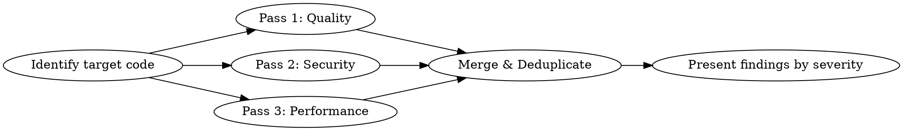

# Deep Code Review

## Overview

A comprehensive code review combining three expert perspectives — **code quality**, **security**, and **performance** — into a single structured review. Each perspective runs as a parallel analysis pass, producing severity-rated findings with actionable fixes.

**Core principle:** Be harsh. Issues caught now cost 10x less than issues caught in production.

## When to Use

- Before creating a pull request
- After implementing a feature or bugfix
- When asked to review code, a diff, or a file
- When auditing unfamiliar or inherited code
- When onboarding to a codebase and assessing quality

**When NOT to use:**
- Trivial one-line changes (typo fixes, version bumps)
- Auto-generated code (migrations, lock files)

## The Three-Pass Review

Run all three passes in parallel using subagents. Each pass produces findings in the standard format below.



### Step 0: Identify Target Code

Determine what to review:
- If reviewing a PR/branch: `git diff main...HEAD` (all commits, not just latest)
- If reviewing specific files: read those files
- If reviewing recent work: `git diff` (unstaged) + `git diff --cached` (staged)

Gather context: language, framework, what the code does, how often it runs, expected data scale.

### Pass 1: Code Quality (The Brutal Reviewer)

Review as a senior developer who would rather reject a PR than let a bug ship.

**Check for:**

| Category | Look For |
|----------|----------|
| **Bugs** | Logic errors, off-by-one, null/undefined handling, race conditions, incorrect comparisons, wrong operator precedence |
| **Error handling** | Swallowed exceptions, missing error paths, catch blocks that hide failures, unhandled promise rejections |
| **Edge cases** | Empty inputs, boundary values, concurrent access, unicode, timezone issues, integer overflow |
| **Maintainability** | Unclear naming, excessive complexity (cyclomatic > 10), duplication, god functions (> 50 lines), deep nesting (> 3 levels) |
| **Correctness** | Does the code actually do what the PR/commit message claims? Are there missing cases in switches/ifs? |
| **API contracts** | Are return types consistent? Can callers get unexpected nulls? Are errors propagated correctly? |

### Pass 2: Security (The Attacker's Mindset)

Audit as someone trying to exploit this code. Assume an attacker with full knowledge of the stack.

**Check for:**

| Category | Look For |
|----------|----------|
| **Injection** | SQL, NoSQL, command, LDAP, template, header injection. Any string concatenation into queries/commands |
| **Auth/AuthZ** | Session handling, privilege escalation, token expiration, missing permission checks, IDOR |
| **Data exposure** | Secrets in logs, verbose error messages leaking internals, API responses with excessive data, PII in URLs |
| **Input validation** | Missing sanitization, type coercion exploits, length limits, path traversal, SSRF via user-supplied URLs |
| **Cryptography** | Weak algorithms (MD5/SHA1 for security), hardcoded secrets, improper key handling, missing salt, predictable randomness |
| **Dependencies** | Known CVEs in imports, overly broad permissions, prototype pollution vectors |

For each finding, include:
- **Attack scenario**: How would someone exploit this? (1-2 sentences)
- **OWASP/CWE reference**: If applicable (e.g., CWE-89: SQL Injection)

### Pass 3: Performance (The Scalability Engineer)

Analyze as if this code will handle 100x its current load tomorrow.

**Check for:**

| Category | Look For |
|----------|----------|
| **Time complexity** | O(n^2) or worse in loops, unnecessary iterations, repeated lookups that should be cached |
| **Database** | N+1 queries, missing indexes (filter/join/order columns), over-fetching (SELECT *), large transactions holding locks |
| **Memory** | Large allocations in hot paths, unbounded collections, missing pagination, memory leaks (event listeners, closures, caches without eviction) |
| **I/O** | Blocking calls on async paths, sequential when parallelizable, missing timeouts on external calls, chatty APIs |
| **Quick wins** | Simple changes with outsized impact — early returns, short-circuit evaluation, batch operations, connection pooling |

For each finding, include:
- **Current behavior**: What happens now under load
- **Expected improvement**: Rough estimate (e.g., "O(n) to O(1) lookup", "eliminates N+1 for collections > 10")

## Finding Format

Every finding across all three passes uses this structure:

```
### [SEVERITY] Category: Short description

**File:** `path/to/file.ext:line`
**Pass:** Quality | Security | Performance

**Problem:** What's wrong, in 1-3 sentences.

**Fix:**
```lang
// suggested code change
```

[Pass-specific fields: attack scenario, OWASP ref, expected improvement, etc.]
```

## Severity Levels

| Level | Definition | Action |
|-------|-----------|--------|
| **CRITICAL** | Will cause data loss, security breach, or outage | Block merge. Fix immediately. |
| **HIGH** | Bug that will hit users, significant security/perf risk | Fix before merge. |
| **MEDIUM** | Code smell, minor risk, suboptimal pattern | Fix in this PR if quick, else track. |
| **LOW** | Style, naming, minor improvement | Optional. Note for awareness. |

## Output Structure

Present the final merged review in this order:

1. **Summary**: One paragraph — overall assessment, number of findings by severity
2. **Critical & High findings**: Grouped, with full detail and fixes
3. **Medium findings**: Grouped, briefer
4. **Low findings**: Bullet list, one line each
5. **What's good**: 2-3 things the code does well (reinforces good patterns)

Deduplicate: if the same code triggers findings in multiple passes (e.g., string concatenation is both a bug and an injection risk), merge into one finding and tag all applicable passes.

## Execution

When reviewing code:

1. **Gather context** — read the code, understand intent, note language/framework
2. **Launch three parallel subagents** — one per pass, each with the relevant checklist above and the code to review
3. **Merge results** — deduplicate, assign final severities, sort by severity
4. **Present** — use the output structure above

If the codebase is small (< 200 lines changed), run all three passes yourself without subagents.

## Common Mistakes

| Mistake | Fix |
|---------|-----|
| Reviewing only the latest commit in a PR | Review ALL commits: `git diff main...HEAD` |
| Flagging style issues as HIGH | Style is LOW. Reserve HIGH for real bugs and risks. |
| Suggesting rewrites instead of targeted fixes | Suggest the minimal change that fixes the issue |
| Missing the forest for the trees | Start by understanding what the code is trying to do |
| Not considering the runtime context | A O(n^2) loop over 5 items is fine. Over 50k items, it's not. Ask about scale. |
